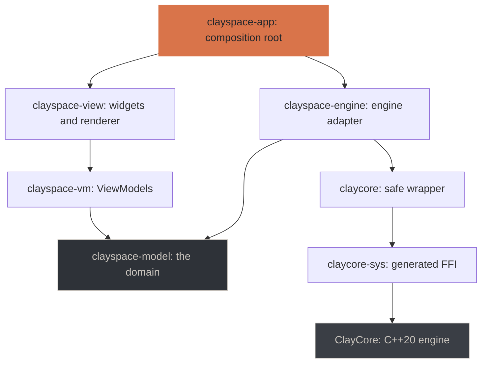
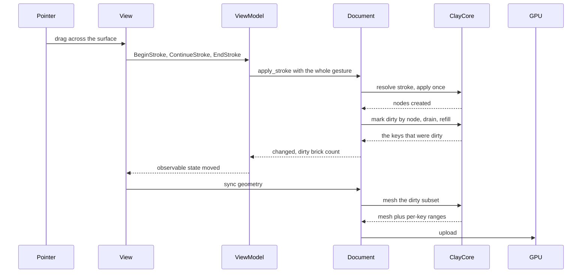

# ClaySpaceDesktop

A 3D sculpting desktop application in Rust, rendering with WebGPU and driving
the [ClayCore](https://github.com/CyberdyneCorp/ClayCore) SDF + voxel engine
through its C ABI. macOS and Linux.

**Two changes: `add-clayspace-desktop` at 107 of 109 tasks, and
`make-representations-first-class` complete.** The first delivered four of five
milestones and all but closed the fifth — sculpt, mask, rig with ZSpheres,
import and export meshes, save, reopen, and recover work a crash took. The
second made SDF, voxel and mesh first-class alongside each other: each with its
own vocabulary, conversions between them, a deformation cage, curves, reference
images and three languages. See [docs/roadmap.md](docs/roadmap.md), which also
lists what the engine currently gets wrong and what that costs.

| | |
|---|---|
| Tests | 1035, all headless |
| Visual captures | 406 PNGs, regenerated by `cargo test` |
| Dab latency | 2.4 ms median, 2.9 ms p95 on the reference scene (budget: 50 / 100) |
| Startup to first document | 25.7 ms |
| Engine | ClayCore 0.39.0, pinned to the release tag as a submodule |

The timing figures are `benchmarks/baseline-linux-x86_64.json`: Linux x86_64 on
CUDA, recorded against ClayCore 0.39.0 with the three representations in place.
There is a baseline per platform, and `just bench-compare` picks by `os()` —
comparing a Linux run against a macOS recording measures the difference between
two machines and calls it a regression. The macOS reference,
`benchmarks/baseline-macos-aarch64.json`, still reads ClayCore 0.29.1 and
predates the reference suite: it names one scene where the suite has five, so a
macOS comparison refuses to run and says which scenes it does not have, rather
than reporting the difference between two suites as ninety regressions.
Re-recording it needs a macOS machine.

## What it does today

```sh
just run          # or: cargo run -p clayspace-app --release
```

Opens a window on a starting form. `just` lists everything else this
repository routinely does; see [Common tasks](#common-tasks).

| Input | Action |
|---|---|
| Left-drag **on the model** | Sculpt with the active tool |
| Left-drag **off the model** | Orbit — ZBrush's rule, and the only one a trackpad can reach |
| Right-drag, or Option-drag | Orbit |
| Middle-drag | Pan |
| Wheel | Zoom **at what is under the pointer**, stopping short of the surface rather than going through it |
| `1`–`4` | Perspective, front, side, top |
| `⌘Z` / `⇧⌘Z` | Undo / redo — one stroke is one undo |
| `X` `Y` `S` | Symmetry — X is **on** by default, as the design asks |
| `[` `]` | Brush smaller / larger |
| `M` / `⇧M` | Mask painting on / off — Blender's key — and cycle materials, which `M` used to do |
| `F` / `Esc` | Frame / quit |
| `⌘S` `⇧⌘S` `⌘O` `⌘N` | Save, save as, open, new |
| `A` / `⇧A` | Skin preview / enter rigging — see below |

**The interface ships in English, Brazilian Portuguese and Spanish**, and opens
in the system's language where that is one of the three, English otherwise.
*View → Language* changes it, each named in itself. Menu names below are given
in English; some vocabulary inside the option bar is still Portuguese whatever
the menu says — see [docs/features.md](docs/features.md#not-built-yet).

`⌘` here is the platform's primary modifier: Command on macOS, **Control on
Windows and Linux**. One table covers all three, because the binding is written
once against that modifier rather than once per platform — see
`crates/clayspace-view/src/shortcuts.rs`, which is the only place a binding is
written down, and `crates/clayspace-app/src/keys.rs`, which is what the event
loop asks.

The options bar carries what the *edit* is, beside what the brush is: thirteen
combine operations and five blend profiles on an SDF layer, with the distance
control beside them. That distance is two quantities under one slider — the
amplitude the surface displaces by for the relief family, the width of the join
for everything else — so the label follows the operation, and for the seven
operations whose whole effect *is* the distance the slider's floor is lifted off
zero. There, zero is not a hard join; it is no operation at all.

**File → Deform** carries the whole-form deformers, taper and twist, each one
undo step. A voxel layer's recorded passes — ZBrush's layers, on a grid — are
nested under it in the layer panel: record a pass, keep sculpting, and dial its
strength back afterwards. Not undo, which is a stack you pop; this is a slider
you keep, and it survives a save and a reload.

**Three representations, each with its own vocabulary.** SDF layers, sparse
voxel grids and fixed-topology meshes are equals here: the tool shelf offers
what the *active layer* has rather than one list with most of it greyed out,
and **File → Convert** crosses between them, stating what the crossing costs
before it runs. Twenty tools are bound across the three — a mesh layer alone
carries the engine's sixteen fixed-topology brushes. A voxel layer is drawn as
its smoothed form rather than as boxes, with the filtering and the box view
both still reachable.

**`M` paints a mask**, frozen regions show through the surface, and the mask
menu carries invert, clear, expand, contract, smooth, the bounded complement
and extrude. **Dynamics → Deformation cage** puts a lattice around the form and deforms
it by dragging control points, with a move/turn/scale manipulator on the
selection; the form is drawn through while the cage is up, so the handles
behind it can still be reached. **Dynamics → Tube along a curve** places a tube through control
points, Nomad's tubes rather than a snakehook's single pull.

**View → Reference images** hangs a PNG or a JPEG behind the form on each of
the three orthogonal planes — the drawing pinned to the wall beside the
monitor, put where it belongs. Each has its own opacity, size, offset and
depth; photographs taken sideways are turned the right way up. The same panel
carries the model's own opacity, so the clay turns translucent and the
reference shows through it.

A layer row is renamed with a double-click on its name and carries its own menu
on a right-click, with *Renomear* and *Excluir* — the latter disabled, with the
reason on it, for the last layer a document has.

**File** carries the document lifecycle and mesh import/export; **Help**
carries the diagnostics report and the attribution manifest.

Closing over unsaved edits asks first, and a session that ends any other way
offers its work back on the next run. **File** carries the whole lifecycle
including *Open recent*, which prunes documents that are no longer there.

While rigging, the pointer means something else. **Sculpt → New armature**
starts one — on a layer of its own, with the sculpt hidden, because a ZSphere
armature is its own tool rather than something added to what you were
sculpting. Then:

- **drag out of a sphere** to grow the next one;
- **drag the membrane between two** to insert a joint there;
- **Option-drag** to move a sphere and everything under it;
- **⌘-drag** to resize;
- `Delete` removes a branch, and **Negative sphere** makes a sphere cut into
  the rig instead of adding to it — the membrane along its links goes with it,
  it may still carry a limb, and the sign survives a save.

`A` toggles the skin preview, as it does in ZBrush: with it off you see the
ZSpheres and the translucent membrane between them, which is what you want
while building. A press on empty space still orbits.

The full list of what works is in [docs/features.md](docs/features.md).

## Architecture

Five layers, with the dependency direction enforced by CI rather than by
review.



Two rules make this checkable rather than aspirational, and
`tools/check_layering.py` asserts both:

- **`clayspace-view` cannot reach the engine**, directly or transitively. A
  View reads ViewModel state and emits commands; it has no other way to affect
  anything.
- **`clayspace-vm` cannot reach `egui`, `wgpu` or `winit`**, so every ViewModel
  is exercised in a test with no window and no GPU.

The domain and the engine adapter are separate crates for exactly this reason:
a single crate holding both would put ClayCore in every layer's transitive
dependencies, and no arrangement of the others could satisfy the isolation
rule. A useful side effect is that the ViewModel tests run without compiling
the C++ engine at all.

`unsafe` lives in `claycore-sys` and `claycore` and nowhere else; every other
crate declares `#![forbid(unsafe_code)]`.

### What happens when you sculpt



The whole gesture reaches the engine as one call, so the stroke engine decides
stamp spacing from arc length rather than from how many samples the device
happened to deliver — and so it undoes as one step.

Only the dirty subset is re-meshed. Details, and the three mistakes that made
the first version cost 267 ms, are in
[docs/architecture.md](docs/architecture.md).

## Prerequisites

| | Minimum | Why |
|---|---|---|
| Rust | 1.82 | workspace edition |
| CMake | 3.24 | ClayCore is a CMake project, built as part of `cargo build` |
| C++ compiler | C++20 | same |
| Network (first build only) | — | ClayCore fetches meshoptimizer, ufbx and xsimd at configure time |
| [`just`](https://github.com/casey/just) | optional | Every recipe has its `cargo` equivalent; `just` is convenience, not a dependency |

Accelerated backends are optional and detected automatically. macOS picks up
Metal from the Xcode command line tools; Linux picks up CUDA (`nvcc` on `PATH`
or `CUDA_PATH`) and Vulkan (`VULKAN_SDK`, or `pkg-config`). **The CPU backend is
always compiled in**, so a machine with none of them still builds and runs.

## Getting it

The engine is a submodule, pinned to an exact commit:

```sh
git clone --recurse-submodules https://github.com/CyberdyneCorp/ClaySpaceDesktop.git
cd ClaySpaceDesktop
just setup        # or: cargo build
```

Already cloned without it? `git submodule update --init --recursive`. Forgetting
this is the most likely first failure, and the build says so by name rather than
letting CMake or the linker produce a worse message.

The first build compiles the C++ engine and takes a few minutes. Later builds
only recompile it when the submodule's sources change.

## Common tasks

Everything routine is a [`just`](https://github.com/casey/just) recipe, so the
long-form commands live in one place. `just` on its own lists them.

| | |
|---|---|
| `just setup` | Fetch the pinned engine and build. What a fresh clone needs |
| `just run` | Open the application |
| `just test` | The whole suite, 1035 tests, no display or GPU required |
| `just check` | Everything CI checks, in the order that fails fastest |
| `just visual` | Render every visual test and open the captures |
| `just bench` | The performance table: every brush, operation, conversion and bake |
| `just bench-only brush` | One group of it, for when the whole table is too long to wait for |
| `just bench-compare` | Against the recorded baseline — this is the CI gate |
| `just bundle` | The distributable: a `.app` on macOS, a tarball on Linux |
| `just engine` | Which ClayCore this build is pinned to |
| `just diagnostics` | What this build is and what it decided to run on |

`just check` runs six gates that are six different tools — formatting, the
layering rules, clippy, the suite, the specification and the packaging
scripts. Knowing to run all six should not depend on having read this file
recently.

## Testing

```sh
just test                         # 1035 tests, no display or GPU required
just test-one visual_brushes      # one target, with output
```

Visual tests render real frames into `target/visual/`, and `just visual`
renders them all and opens the directory.

These are meant to be looked at. Several real bugs were invisible to the
assertions and obvious in the picture — see
[docs/architecture.md](docs/architecture.md#what-the-captures-caught).

## Choosing backends explicitly

Detection is automatic, but can be overridden:

```sh
just run-cpu                                      # CPU only, any platform
CLAYCORE_CPU_ONLY=1 cargo build                   # the same, longhand
cargo build -p claycore --features metal          # require Metal
cargo build -p claycore --features cuda,vulkan    # require both
```

Note that CPU-only is an **environment variable and not a cargo feature**:
`CLAYCORE_CPU_ONLY` reaches the C++ configure step, which is where backends
are actually chosen. Every crate here declares `default = []`, so
`--no-default-features` would build exactly what a plain build does.

Naming a feature whose toolchain is missing is a **hard error** at configure
time, with the reason. Silently dropping it would produce a binary that cannot
register the backend you asked for.

Backend choice affects speed, never results. The engine holds every GPU backend
to 1e-4 relative against the CPU scalar reference, and
`every_registered_backend_agrees_with_cpu` asserts it here too.

```sh
just diagnostics   # or: cargo run -p claycore --example diagnostics
```

```
engine version   : 0.39.0
expected ABI     : 0.39.0
compiled backends: metal
registered       : cpu, metal
```

Those two lines answer different questions. *Compiled* is what the build
selected; *registered* is what the engine found at runtime. A backend can be
compiled in and still fail to register, so only the second is trustworthy.

## Layout

```
crates/
  claycore-sys/      generated FFI to clay.h; no hand-written declarations
  claycore/          safe wrapper — the only crate that calls claycore-sys
  clayspace-model/   the domain: tools, interfaces, types. No engine dependency
  clayspace-engine/  the ClayCore-backed implementations of those interfaces
  clayspace-vm/      ViewModels: observable state + commands, no egui/wgpu
  clayspace-view/    widgets and renderer; cannot reach the engine at all
  clayspace-app/     composition root, window, event loop
docs/                architecture, features, roadmap
tools/               the layering check
vendor/ClayCore/     the engine, pinned
openspec/            the specification this is built against
```

## Working on it

This project is specified before it is built. The specification lives in
`openspec/` and is the source of truth for what the application should do.

```sh
openspec list
openspec show add-clayspace-desktop
openspec validate --all --strict
```

Implementation follows `openspec/changes/add-clayspace-desktop/tasks.md`.
Behaviour changes go into the specification first.

## Documentation

| | |
|---|---|
| [docs/architecture.md](docs/architecture.md) | How the layers fit, and the decisions behind them |
| [docs/features.md](docs/features.md) | What works today, tool by tool |
| [docs/roadmap.md](docs/roadmap.md) | Milestones, what is left, open decisions |

## Licence

MIT. ClayCore is MIT with an all-permissive dependency manifest, so static
linking imposes no copyleft obligation.
