# ClaySpaceDesktop

A 3D sculpting desktop application in Rust, rendering with WebGPU and driving
the [ClayCore](https://github.com/CyberdyneCorp/ClayCore) SDF + voxel engine
through its C ABI. macOS and Linux.


Sculpt on a signed distance field, on a sparse voxel grid or on a
fixed-topology mesh; freeze regions with a mask; rig with ZSpheres; place
primitives as separate subtools and resolve two of them into a third with a
boolean; import and export meshes; save, reopen, and recover the work a crash
took. The interface ships in English, Brazilian Portuguese and Spanish.

**Status.** The specification lives in `openspec/` and its tasks files are the
authority on what is done: twenty-six changes, seventeen of them with every
task ticked. `add-clayspace-desktop` stands at 107 of 109 tasks — milestones 1
to 4 delivered and milestone 5 all but closed — and what is still open in
`benchmark-every-operation` and `upgrade-engine-0-52-2` is the same single
task, a macOS re-recording that needs a macOS machine.
[docs/roadmap.md](docs/roadmap.md) carries the milestone table, what the engine
currently gets wrong, and what that costs.

**The engine pin now stands at v0.73.0**, and two things came with it that had
been waiting on the engine. A painted mask protects a region from an
*operation* and not only from a brush — `clay_item_set_gate` had been accepted
and inert since v0.39.0, measured, filed as
[#394](https://github.com/CyberdyneCorp/ClayCore/issues/394) and held open by a
tripwire test that fired on this upgrade. And a mesh subtool can be **rebuilt**
— DynaMesh — so a form pulled somewhere its triangles could not follow has a
way back. See `openspec/changes/upgrade-engine-0-73-0/`.

| | |
|---|---|
| Tests | 1670, all headless — one ignored against a known defect, one a measuring aid |
| Visual captures | 658 PNGs, regenerated by `cargo test` |
| Dab latency | 2.1 ms median, 4.2 ms p95 on the reference scene · budget 50 / 100 |
| Startup to first document | 11.4 ms |
| Engine | ClayCore 0.73.0, pinned to the release tag as a submodule |
| Sculpting tools | 21 across three representations · 14 SDF, 13 voxel, 17 mesh |
| Languages | English, Português do Brasil, Español latinoamericano |

The timing figures are `benchmarks/baseline-linux-x86_64.json`: Linux x86_64 on
CUDA, recorded against ClayCore 0.52.2 on a quiet machine — 0.13 load per core,
stamped in the file beside the rest of the conditions. The nine `subtool.*`
figures were added to that file from a later whole run on the same machine, at
0.08 load per core, rather than by re-recording it: a re-recording moves the
value every future run is judged against, and the comparison that run made
against the baseline reported no regression in any of the other 125 figures. So
the rest of the file still holds the drift history it had.

Three figures have been spliced in the same way since, from a whole run at 0.07
load per core: `subtool.activate.mesh.mean` and `.p95`, which went from 159.7
and 169.6 ms to a lookup when the document started holding a mesh sculptor per
subtool rather than one; and `convert.mesh_to_voxel.ms`, which the file used to
carry as a *skip* — "the source layer states no bounds to convert within" —
because a mesh layer answered no bounds and every crossing out of one was
refused as unbounded. It runs, so it is measured rather than excused. The
comparison that run made found nothing else moved by more than 1.19x, inside
the 1.5 tolerance.

There is a baseline per platform, and `just bench-compare` picks by `os()` —
comparing a Linux run against a macOS recording measures the difference between
two machines and calls it a regression. The macOS reference,
`benchmarks/baseline-macos-aarch64.json`, still reads ClayCore 0.29.1 and
predates the reference suite: it names one scene where the suite has five, so a
macOS comparison refuses to run and says which scenes it does not have, rather
than reporting the difference between two suites as ninety regressions.
Re-recording it needs a macOS machine.

---

## Contents

- [Running it](#running-it) · [Pointer and keys](#pointer-and-keys)
- [Features](#features) — [the shelf follows the active
  layer](#the-shelf-follows-the-active-layer) ·
  [sculpting](#sculpting-a-stroke-is-one-call-and-one-undo) ·
  [focus mode](#focus-mode-and-the-regions-that-move) ·
  [masking](#masking) · [subtools](#a-scene-is-a-list-of-subtools) ·
  [shapes](#inserting-a-form-and-where-it-goes) ·
  [booleans](#a-boolean-between-two-subtools) ·
  [conversions](#crossing-between-representations) ·
  [voxel grids](#voxel-grids) ·
  [mesh layers](#mesh-layers-and-rebuilding-one) ·
  [deformers, cage and curves](#deformers-a-cage-and-a-curve) ·
  [armatures](#zsphere-armatures) · [reference
  images](#reference-images) · [viewport](#viewport-and-shading) ·
  [geometry in and out](#geometry-in-and-out) ·
  [documents](#documents-history-and-sessions) ·
  [languages](#three-languages) ·
  [acceleration and diagnostics](#acceleration-and-diagnostics) ·
  [not built yet](#what-is-not-built-yet)
- [Architecture](#architecture) — [the
  layers](#the-layers) · [a
  stroke](#what-happens-when-you-sculpt) · [how a document is
  arranged](#how-a-document-is-arranged) · [what the pointer
  means](#what-the-pointer-means) · [the build](#what-a-build-actually-does)
- [Prerequisites](#prerequisites) · [Getting it](#getting-it) · [Common
  tasks](#common-tasks) · [Testing](#testing) ·
  [Backends](#choosing-backends-explicitly) · [Layout](#layout) · [Working on
  it](#working-on-it)

---

## Running it

```sh
just run          # or: cargo run -p clayspace-app --release
```

Opens a window on a starting form. `just` lists everything else this
repository routinely does; see [Common tasks](#common-tasks).

### Pointer and keys

| Input | Action |
|---|---|
| Left-drag **on the model** | Sculpt with the active tool |
| Left-drag **off the model** | Orbit — ZBrush's rule, and the only one a trackpad can reach |
| Right-drag, or Option-drag | Orbit |
| Middle-drag | Pan |
| Wheel | Zoom **at what is under the pointer**, stopping short of the surface rather than going through it |
| `1`–`4` | Perspective, front, side, top |
| `⌘Z` / `⇧⌘Z` | Undo / redo — one stroke is one undo |
| `X` `Y` `S` | Symmetry — X is **on** by default, as the design asks |
| `[` `]` | Brush smaller / larger |
| `M` / `⇧M` | Mask painting on / off — Blender's key — and cycle materials, which `M` used to do |
| `F` / `Esc` | Frame / quit |
| `Tab` | Focus mode — the chrome clears and the sculpt fills the window |
| `⌘S` `⇧⌘S` `⌘O` `⌘N` | Save, save as, open, new |
| Click **a form** | Make its subtool the one being sculpted — the next dab lands there, and the shelf offers that subtool's representation |
| Click **a placed shape** | Select it — clicking the wall of a hole selects the shape that cut it — and activate the subtool it stands in |
| Drag **the manipulator** | Move, turn or scale what is selected: a whole subtool, an object, a mesh or a curve |
| `W` `E` `R` | Move, turn, scale — Maya's and Unity's keys; pressed with nothing selected, the widget goes up on the whole subtool |
| `A` / `⇧A` | Skin preview / enter rigging — see [ZSphere armatures](#zsphere-armatures) |

`⌘` here is the platform's primary modifier: Command on macOS, **Control on
Windows and Linux**. One table covers all three, because the binding is written
once against that modifier rather than once per platform — see
`crates/clayspace-view/src/shortcuts.rs`, which is the only place a binding is
written down, and `crates/clayspace-app/src/keys.rs`, which is what the event
loop asks.

While rigging, a deformation cage is up, or a mask gesture is armed, the
pointer means something else — see [what the pointer
means](#what-the-pointer-means).

---

## Features

The full list, tool by tool and control by control, is in
[docs/features.md](docs/features.md). Every tool there names the ClayCore entry
point it invokes, so a binding can be checked against the engine's own
documentation without reading the implementation. A tool with no engine
counterpart is not offered.

### The shelf follows the active layer

**SDF layers, sparse voxel grids and fixed-topology meshes are equals here.**
The three stand above the viewport as three cards with the crossings beside
them, and the tool shelf offers what the *active layer* has rather than one
list with most of it greyed out. Twenty-one tools are bound across the three:
fourteen have an SDF verb, thirteen a voxel one, and seventeen a mesh one — a
mesh layer alone carries the engine's sixteen fixed-topology brushes.

The same shelf on a field, on a grid and on a mesh. The filter column on the
left switches between what the active layer can run, each representation's own
list, and the brushes that have been starred; the row scrolls where the
vocabulary is longer than the window:


Which tool reaches which representation is a declared table rather than a rule
written per tool, and the shelf, the availability check and the tests all read
it — so the list you see and the list that works cannot drift apart. A tool
with no verb on the active representation is *absent* rather than shown and
greyed: with three vocabularies a single list would be mostly disabled rows all
saying the same sentence. A tool that *does* have a verb and still cannot be
used — the layer is locked, hidden, or missing an attribute the tool needs — is
shown disabled and says which of those it is.

Changing the active layer keeps the active tool where the new representation
has it and substitutes one where it does not, saying so in the status line
rather than resetting silently. Brush settings are held per tool *and* per
representation: a size that suits a grid's cells is not the size that suits a
field.

**Every swatch carries a mark saying what the brush does** — a hump for
Standard, a swollen ring for Inflate, ripples dying to a line for Smooth, a
hatch for Mask, a planed-off hump for Scrape, a tendril for Snake Hook — drawn
with one pen at one weight, in the ground's ink on the lit clay. A row of
identical grey balls told apart by the word under each is a shelf the eye has
to read one by one; ZBrush's is read by shape first. **A brush can be starred**
from its own menu, and the shortlist is kept between sessions and spans every
representation, because its purpose is finding a brush again rather than
describing the active layer.

### Sculpting: a stroke is one call and one undo


The whole gesture reaches the engine as one call, so the stroke engine decides
stamp spacing from arc length rather than from how many samples the device
happened to deliver — and so it undoes as one step, mirrored halves included.

**The stroke's settings are on one bar.** Intensity, size, flow, the smoothing
and the symmetry axes sit together on the options bar, with an engaged axis in
the soft accent rather than a raised grey: symmetry is state a sculptor needs
to see without looking for it, and a mirrored stroke they did not expect is the
most expensive surprise on the bar.

| Control | Maps to | Range |
|---|---|---|
| Intensity | stroke strength | 0–1 |
| Size | stroke radius, in document units | 0.005–1 |
| Flow | stamp spacing | 0.01–1 |
| Smoothing | lazy-mouse lag | 0–0.95 |
| Noise | positional jitter | 0–1 |
| Edge | falloff: hard, linear, smooth, Gaussian | — |
| Accumulate | buildup against clamped accumulation | on/off |

The bar carries what the *edit* is beside what the brush is: **thirteen combine
operations and five blend profiles** on an SDF layer, with the distance control
beside them. That distance is two quantities under one slider — the amplitude
the surface displaces by for the relief family, the width of the join for
everything else — so the label follows the operation, and for the seven
operations whose whole effect *is* the distance the slider's floor is lifted
off zero. There, zero is not a hard join; it is no operation at all.

**A brush colour** is shown for the two tools that read one, Paint and Smear,
and hidden for the ones that do not, because a control that does nothing is
worse than an absent one. Unlike every other brush setting it is shared across
tools — it is what you are painting with right now. A grid stores palette
indices, so the adapter resolves the colour to an entry before painting and
only a genuinely new colour adds one.

**Symmetry about X, Y and Z reaches all three representations**, and belongs to
the *subtool* rather than to the document: switching subtools restores that
subtool's own axes. A new subtool starts with X on.

### Focus mode, and the regions that move


**`Tab`, or Window → Focus mode, clears the chrome.** The tool rail, the
options bar, the representation bar, both inspectors, the shelf and the status
area go, and the sculpt stays. The menu bar stays with it, because a mode
nobody can find their way out of is worse than no mode and `Tab` is not
discoverable from an empty window; and a floating readout keeps the brush's
ball and mark, its name, the representation a stroke would land on, and its
size, intensity and flow, since hiding the bar that carries those without
replacing them would be focus in name only.

It is a presentation override rather than a layout: it hides the regions
without touching the sizes and collapse states a sculptor chose, so leaving it
puts everything back, and it is deliberately not remembered — an application
that opened with its panels gone would look broken.

**The regions move, and are remembered.** The left region, the right region and
the shelf are resizable, clamped so that none can vanish or swallow the
viewport; each can be put away and brought back from the Window menu, with a
reset that returns every one to the design's own size; and the arrangement is
stored beside the recent documents and the chosen locale, so it is as it was
left when the application opens again. The viewport's quality profile — under
*View → Viewport quality*, as performance, sculpt or presentation — is
remembered too.

### Masking


**`M` paints a mask** and `M` again puts the tool you were using back in your
hand — Blender's key, and a toggle because freezing a region is a detour rather
than a mode to live in. Frozen clay reads as a dark neutral over the shading at
roughly three quarters strength, so the form underneath stays legible; masking
protects the surface almost completely, and a sculptor who cannot see the mask
cannot tell a protected stroke from a failed one.

The mask can also be **drawn round** rather than painted: a lasso or a
rectangle on the view frame, freezing or thawing what it encloses. The Masks
menu carries invert, clear, expand, contract, smooth, the bounded complement
and extrude — outward, inward or centred. A mask belongs to the subtool it was
painted on and is written with the document, so it is still there when the file
is opened again.

**Since v0.73.0 a mask protects a region from an *operation* and not only from
a brush.** `clay_item_set_gate` had been accepted and inert since v0.39.0 —
measured, filed as
[ClayCore#394](https://github.com/CyberdyneCorp/ClayCore/issues/394), and held
open by a tripwire test written to fail the day it started working. It fired on
the upgrade.

### A scene is a list of subtools


Each form in the scene is a layer of its own, with its own transform, its own
representation, its own mask, its own symmetry axes and its own rig — ZBrush's
word for the arrangement, and the arrangement the engine has always had
underneath.

Click a form in the viewport or a row in the stack and that subtool is the one
being sculpted: the next dab lands on it, the shelf offers what it is made of,
and it is tinted or outlined so which one is active can be read off the
viewport. A layer row is renamed with a double-click on its name and carries
its own menu on a right-click, with *rename* and *delete* — the latter
disabled, with the reason on it, for the last layer a document has. The row's
menu also shows one subtool alone and brings the rest back.

The manipulator moves, turns and scales a whole subtool the way it already
moved a placed shape, and **it is seen through the form it stands on**: every
arm and ring is drawn faint where the clay is in front of it, so a rotate hoop
reads as a hoop the form passes through rather than a flat circle painted on
the frame. Faint is a cue and not a state — the hit test walks every handle by
ray and ignores depth, so a handle drawn faint is as easy to grab as one drawn
bright.

While the manipulator is on a *placed object* its transform stands in the
viewport's lower-leading corner — position, an axis and one angle for rotation,
and scale — because a widget shows that something moved and never by how much.
A placed object stretches per axis; a whole subtool scales uniformly, because
the engine's layer transform takes one factor where its node transform takes
three.

**When a subtool has become costly to evaluate** the objects panel says so and
offers to consolidate it, with the cost of doing that stated.

### Inserting a form, and where it goes


**File → Shapes** inserts a form and asks where it goes. *New subtool* — the
default — makes it a layer of its own, active on arrival and standing where the
pointer was, so the next dab lands on it; *Into the active subtool* puts it into
the layer being worked, which is how the parts of one form are built.

Three sources: the **fourteen bounded primitives**, a **mesh read from a file**,
and a **copy of a subtool already in the scene**. Each arrives as one undo step.
A copy is a *copy* — the engine has no instancing, so sculpting it cannot reach
the original. The layer stack's add control asks the same question: a new layer
declares whether it is a field or a grid rather than being crossed to one
afterwards. Not a carried mesh, because there is no way to make an empty one —
a mesh subtool comes from the import above, which brings its own.

### A boolean between two subtools


**File → Boolean between subtools** combines two whole forms into a third. Pick
which is cut and which cuts, pick union, subtraction or intersection, read what
it costs, and confirm. What arrives is an ordinary subtool: sculptable,
movable, an operand again.

It is a **resolved** boolean and the panel says so — the engine composes layers
by hard union, so moving an operand afterwards does not update the result —
which is why the operands are kept, hidden, and one `⌘Z` takes the whole
operation back with them visible again. Every representation can be an operand,
with the crossing each one needs performed as part of the operation rather than
demanded beforehand.

### Crossing between representations


ClayCore carries SDF, voxel and mesh side by side, and the intended workflow
uses more than one: **block out and hard-surface on SDF, free-form sculpt on
voxels, refine on a mesh when the topology is one you want to keep.** Every
representation reaches both of the others, so six crossings are offered — from
**File → Convert**, or from the row beside the representation cards, which
offers exactly the ones the active layer declares.

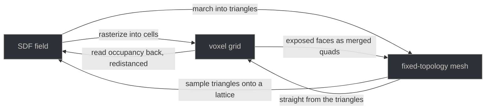

| From | To | What it does |
|---|---|---|
| SDF | voxel | Rasterizes the field into cells over the layer's bounds |
| SDF | mesh | Marches the field into triangles — watertight and 2-manifold by construction |
| voxel | SDF | Reads occupancy back, redistanced, as an ordinary operand — one volume item per palette entry, which is what carries the colour |
| voxel | mesh | The grid's exposed faces as merged quads, with the palette colour on the face |
| mesh | voxel | Straight from the triangles in one sampling, so a feature thinner than a cell survives where a field detour loses it |
| mesh | SDF | Resamples the triangles onto a lattice as a volume item |

**The panel states what the crossing costs before it runs**, computed from the
cell size rather than written down, so the figures move as the slider moves:
how far the surface can travel, what thickness of feature vanishes, how many
cells the region holds, and whether sharp edges, colour and the parametric
history survive. A crossing into a mesh states one more — the topology is the
sampling lattice's and nothing here re-flows it.

A card converts nothing. Crossing costs work and is not always reversible, so
it stays behind the panel where the cost is stated and confirmed.

### Voxel grids


A grid is drawn, framed and picked by its own routes — the engine is explicit
that a voxel layer carries no SDF content — and it is drawn as its **smoothed
form** rather than as the boxes it is, with the box view and the filtering both
still reachable:

| smoothed | as the cells it is |
|---|---|
| 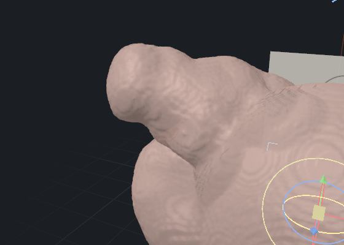 | 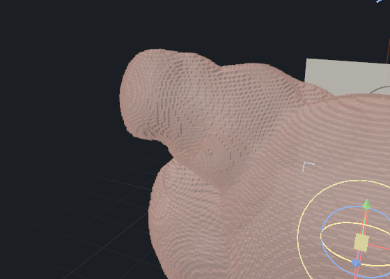 |

**Recorded passes** — ZBrush's layers, on a grid — are nested under the layer
in the panel: record a pass, keep sculpting, and dial its strength back
afterwards. Not undo, which is a stack you pop; this is a slider you keep, and
it survives a save and a reload. **Pre-bake repair** is in *File → Repair*: a
sealed void is invisible until something needs the model to be solid, so the
panel reports what is wrong before offering to change anything.

### Mesh layers, and rebuilding one


A mesh layer is fixed topology: the sixteen brushes move the vertices that are
there and neither add nor remove any. When a form has been pulled somewhere its
triangles could not follow, **Rebuild the mesh** — DynaMesh, in the vocabulary
most sculptors bring with them — throws the geometry into a voxel grid and
marches a new surface out of it. Overlapping shells fuse into one skin,
self-intersections resolve, stretched triangles disappear, and the density
comes out even.

One number and three switches: the *resolution* is cells across the form's
longest dimension, so it means the same thing on a thumbnail and on a bust;
*remove loose pieces* discards fragments too small for that resolution to have
described; *follow the current form* pulls the new surface most of the way back
onto the one it replaces; and *sharp edges* holds corners instead of rounding
them, at the cost of the watertight guarantee.

**It says what it destroyed.** Every rebuild is destructive — vertex and
polygon identity are gone, and texture coordinates are dropped rather than
reprojected — so the triangle counts before and after stay beside the button,
along with the number of separate pieces the form is now in, which is the
answer to the question a sculptor actually asks: *did those two actually join?*
Nothing is written until the rebuild has succeeded and validated, so a
resolution the form turns out not to survive gives a sentence and leaves the
layer byte-identical.

### Deformers, a cage and a curve


**Dynamics → Deformation cage** puts a lattice around the form and deforms it
by dragging control points, with a move/turn/scale manipulator on the
selection. ZBrush spells it the Gizmo Lattice, Blender the Lattice modifier,
Maya an FFD. The form is drawn through while the cage is up, so the handles
behind it can still be reached, and the cage's manipulator is a share of the
*camera's* distance like every other, so it keeps its size to the hand.

**File → Deform** carries the whole-form deformers, taper and twist, each one
undo step.

**Dynamics → Tube along a curve** places a tube through control points —
Nomad's tubes rather than a snakehook's single pull. What makes it different
from a brush is not the shape it leaves but that it can be *gone back to*: a
stroke is over when the pointer comes up, and a curve is a set of points that
stay where they were put. Thickness, join — corners, through the points, or
rounded — and profile — circle, square, hexagon, triangle — are the controls,
and *Apply* leaves the swept form and takes the curve down.

### ZSphere armatures

**Sculpt → New armature** starts one, on a layer of its own with the sculpt
hidden, because a ZSphere armature is its own tool rather than something added
to what you were sculpting. Then the pointer means something else:

- **drag out of a sphere** to grow the next one;
- **drag the membrane between two** to insert a joint there;
- **Option-drag** to move a sphere and everything under it — in the tree *and*
  in the surface, so lifting a shoulder brings the arm;
- **⌘-drag** to resize;
- `Delete` removes a branch, and **Negative sphere** makes a sphere cut into
  the rig instead of adding to it — the membrane along its links goes with it,
  it may still carry a limb, and the sign survives a save;
- a press on empty space still orbits, so a rig can be turned to look at
  without leaving the mode.

Mirrored authoring follows the subtool's own symmetry axes: one drag makes two
limbs, and the reflection hangs off the *parent's* reflection, so two arms end
up on two shoulders. A rig belongs to the subtool that holds its nodes, and a
document may carry one per subtool.

`A` toggles the skin preview, as it does in ZBrush. With it off you see the
ZSpheres and the translucent membrane between them, which is what you want
while building:

| skin preview on | skin preview off |
|---|---|
| 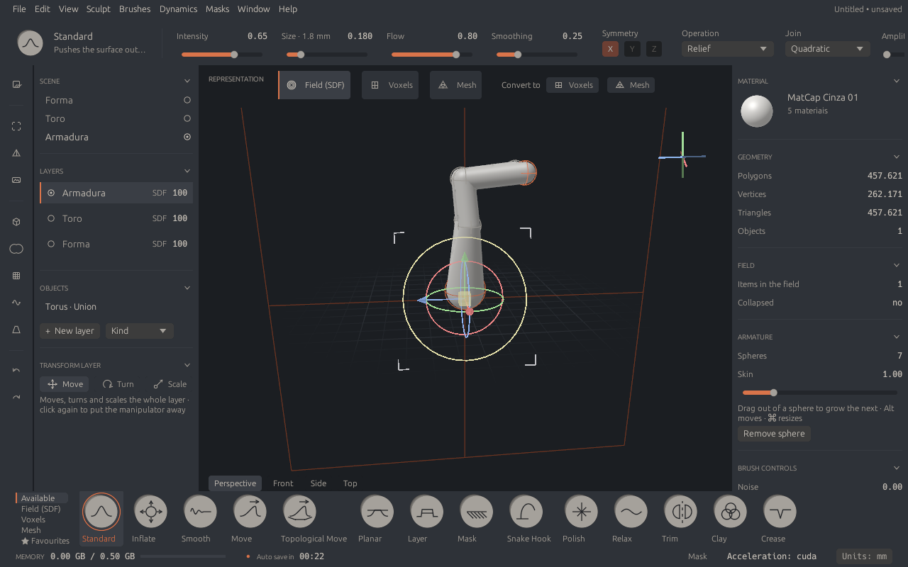 | 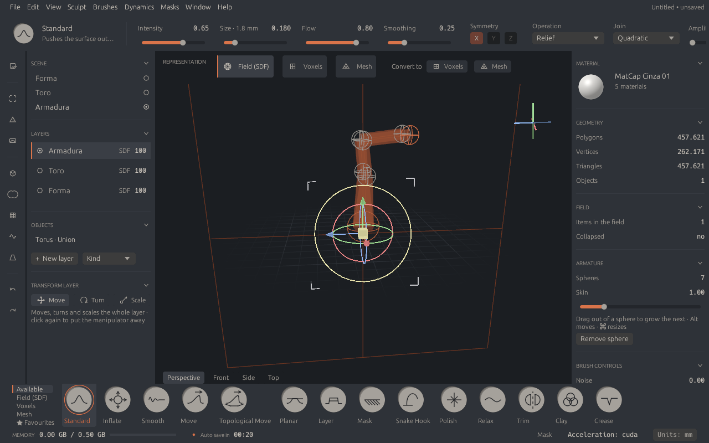 |

### Reference images


**View → Reference images** hangs a PNG or a JPEG behind the form on each of
the three orthogonal planes — the drawing pinned to the wall beside the
monitor, put where it belongs.

One picture a plane, each with its own opacity, height, offset across and up,
and how far back it sits; width follows the image's own proportions, so a
reference is never squashed. **The clay is always in front** from every angle —
references are drawn first and write no depth, because a guide that occludes
the form it is guiding has stopped being a guide. Photographs taken sideways
are turned the right way up: all eight EXIF orientations are applied, once, to
the pixels. The same panel carries the model's own opacity, so the clay turns
translucent and the reference shows through it.

### Viewport and shading

MatCap and studio shading, ambient occlusion, cavity shading, a polyframe, and
five materials, with the quality profile — performance, sculpt or presentation
— chosen under *View* and remembered. **The symmetry plane is an outline, not a
lattice**: six lines at a fifth of the accent, saying where the mirror is and
putting nothing across the clay. The navigation gizmo draws each half-axis as a
bundle of lines so it reads as a rod rather than a hairline.

The wheel **zooms at what is under the pointer and stops a little short of
it**, which is Blender's behaviour: it stops against the clay rather than
clamping to an absolute distance, and it aims at the surface rather than at the
scene's centre.

**A surface the device cannot hold is drawn coarser, not fatally.** A subtool
scaled up a few times is ten million vertices at the field's fixed resolution;
the device is asked for the adapter's own ceiling, a validation error is
reported rather than fatal, and a layout that would still not fit drops the
viewport to the coarse level, which the geometry panel says.

### Geometry in and out

**Importing** asks one real question — reference or clay — because it cannot be
asked afterwards. A *reference* keeps the triangles verbatim on a layer of its
own; *clay* resamples into a field and is sculptable from then on. OBJ, PLY and
FBX go in; **GLB is export-only**, so the import dialog does not offer it and a
GLB passed in anyway is refused by name. A vertex and triangle ceiling is
checked against the file's *declared* counts before anything is allocated,
because a malformed file can claim a billion triangles.

**Exporting** meshes the field *and* every visible mesh layer — meshing the
field alone would silently leave every imported reference out of the file.
Mesher, cell size and decimation are chosen in the panel, and what the write
will give up is said beforehand rather than discovered in the file: PLY has no
texture coordinates, FBX does not carry vertex colour, the fast mesher is not
manifold.

### Documents, history and sessions

- Save, open, new, save-as, and a **File** menu carrying all of it plus *Open
  recent*, which prunes documents that are no longer there.
- **Autosave every two minutes**, and only while there is something to lose.
  The status area says which it is — *nothing to save*, or the time until the
  next one — so whether the work is safe is readable rather than assumed.
- A marker file written when a session opens and removed when it closes is what
  tells the next run whether the last one crashed. Closing over unsaved edits
  asks first; a session that ends any other way offers its work back on the
  next run. Recovered work is unsaved work — it does not take the recovery
  file's path, and it is marked modified.
- Undo and redo over the engine's own vocabulary. A stroke of any length is
  **one** entry. An edit that changed nothing adds no entry and does not mark
  the document modified — the engine documents several verbs as legitimately
  able to change nothing, so a successful call is not evidence that anything
  happened.
- Which shapes were *placed* live in a side-car, `<name>.clay.objects`, beside
  the document: the `.clay` format is the engine's, and which nodes a sculptor
  put there is this application's own bookkeeping. Send someone the `.clay` on
  its own and it opens and sculpts with every boolean intact.
- Session state — the recent list, the chosen language, the panel arrangement,
  the viewport profile, the starred brushes and each reference plane's path and
  placement — lives in Application Support on macOS and `$XDG_STATE_HOME` on
  Linux. State, not cache: losing it costs work.

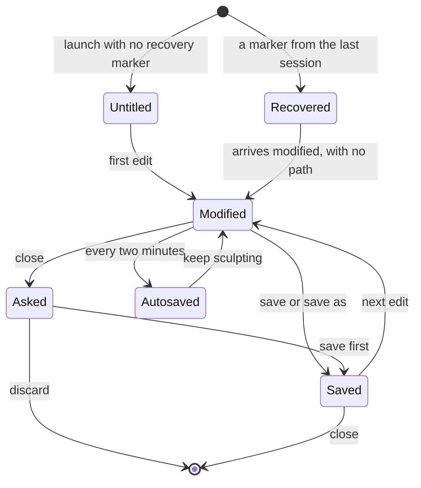

### Three languages


**View → Language** chooses between three complete translations: Português
(Brasil), English (US) and Español (Latinoamérica). Each is named in itself,
which is the one rule a language menu has — a reader who cannot read the
current interface can still find their own. The choice is written to the
session directory, so it survives a restart.

The interface **opens in English**, which is not the design's own language and
is deliberate: it has to open in something a first-time reader can make sense
of. A system language still wins over that default on a first run where it is
one of the three.

Some vocabulary inside the option bar and the viewport bar is still Portuguese
whatever the menu says — see
[docs/features.md](docs/features.md#not-built-yet), which names the enums it
comes from and the ratchet that stops the list growing.

### Acceleration and diagnostics


Backends are discovered at runtime and ranked per platform — `metal → cpu` on
macOS, `cuda → vulkan → opencl → cpu` on Linux. The CPU backend is always
compiled in, so selection never fails for want of a candidate, and where a
backend declines an operation the fallback is **per operation**: the selected
backend stays active for everything it does support.

**Refill is routed per batch, and the routing is measured.** A brick refill goes
to the CPU below sixteen bricks whatever the machine — what that avoids is the
fixed cost of a device submission, a property of the call rather than of the
hardware. Above it, the first large refill of a session is split into a warm-up
and two timed slices, and every refill after that is timed too, so the routing
keeps following the machine. This replaced a constant measured on an M-series
Mac: on a 24-thread Linux box with an RTX 5060, CUDA is 3.5x *slower* than the
CPU at every batch size from 8 bricks to 7600.

**Help → Diagnostics** carries the application version, the engine version, the
vendored engine's git revision, the platform, every registered backend, the
active one and why, the graphics adapter, anything that fell back this session,
and anything that held the interface thread longer than one frame — one line
per operation, keeping the worst time and counting the occurrences. One button
puts the lot on the clipboard. **Help → Attributions** shows the attribution
manifest, generated from `cargo metadata` and embedded in the binary rather
than shipped beside it.

One engine unit is a centimetre and lengths read in millimetres; switching the
display unit is presentation only and changes no geometry.

### What is not built yet

Shortcuts are fixed. Bezier handles on a curve, reopening a curve after it is
applied, colour on a field, and the rest of the domain's vocabulary in more
than one language are named with their reasons in
[docs/features.md](docs/features.md#not-built-yet), along with the four things
that are blocked on the engine and filed upstream — an SDF pinch
([#391](https://github.com/CyberdyneCorp/ClayCore/issues/391)), alpha stamps on
an SDF stroke ([#392](https://github.com/CyberdyneCorp/ClayCore/issues/392)), a
live preview under a voxel drag
([#393](https://github.com/CyberdyneCorp/ClayCore/issues/393)), and a voxel
crease.

Soft-body dynamics and mesh-surface booleans are **deliberately absent** rather
than pending, with the reasons under *Deliberately absent*. What is offered and
does the wrong thing is called out under *Known-degraded* rather than quietly
omitted.

---

## Architecture

[docs/architecture.md](docs/architecture.md) has the decisions and the
measurements behind them; this is the shape.

### The layers

Five layers, with the dependency direction enforced by CI rather than by
review.

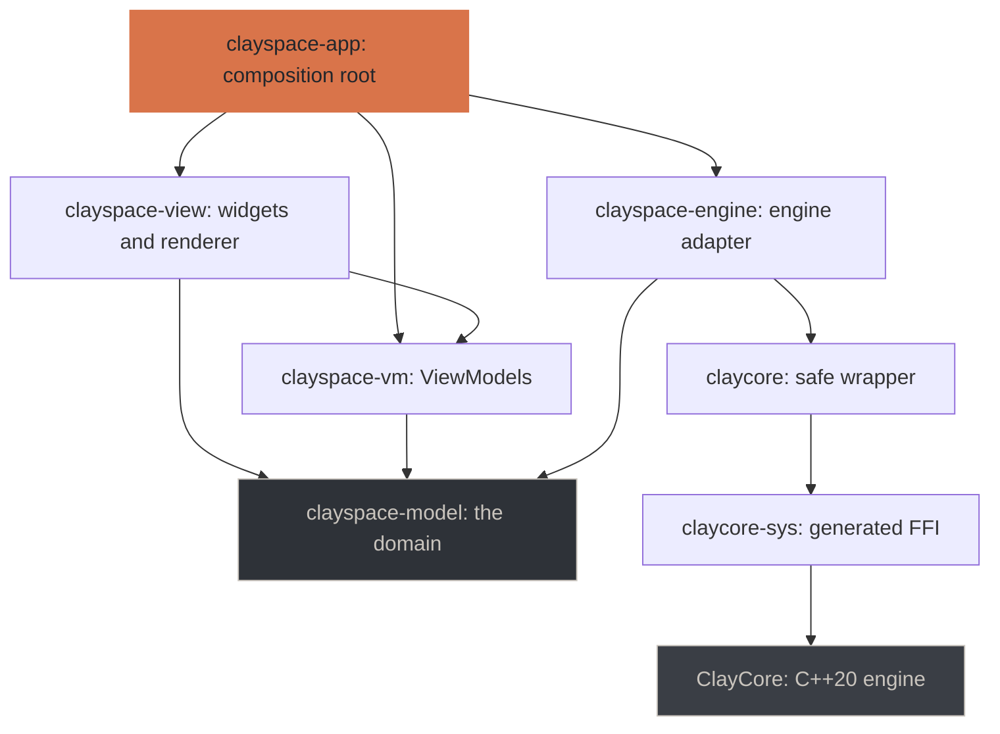

| Crate | Holds | Must not reach |
|---|---|---|
| `claycore-sys` | Generated FFI to `clay.h`. No hand-written declarations | — |
| `claycore` | Safe wrapper: ownership, errors, threading | — |
| `clayspace-model` | The domain: tools, interfaces, types | ClayCore |
| `clayspace-engine` | The ClayCore-backed implementations of those interfaces | — |
| `clayspace-vm` | ViewModels: observable state and commands | egui, wgpu, winit, ClayCore |
| `clayspace-view` | Widgets and the renderer | ClayCore, directly or transitively |
| `clayspace-app` | Composition root, window, event loop | — |

Two rules make this checkable rather than aspirational, and
`tools/check_layering.py` asserts both:

- **`clayspace-view` cannot reach the engine**, directly or transitively. A
  View reads ViewModel state and emits commands; it has no other way to affect
  anything.
- **`clayspace-vm` cannot reach `egui`, `wgpu` or `winit`**, so every ViewModel
  is exercised in a test with no window and no GPU.

The domain and the engine adapter are separate crates for exactly this reason:
a single crate holding both would put ClayCore in every layer's transitive
dependencies, and no arrangement of the others could satisfy the isolation
rule. A useful side effect is that the ViewModel tests run without compiling
the C++ engine at all.

`unsafe` lives in `claycore-sys` and `claycore` and nowhere else; every other
crate declares `#![forbid(unsafe_code)]`, and the layering check fails if one
drops the declaration.

### What happens when you sculpt

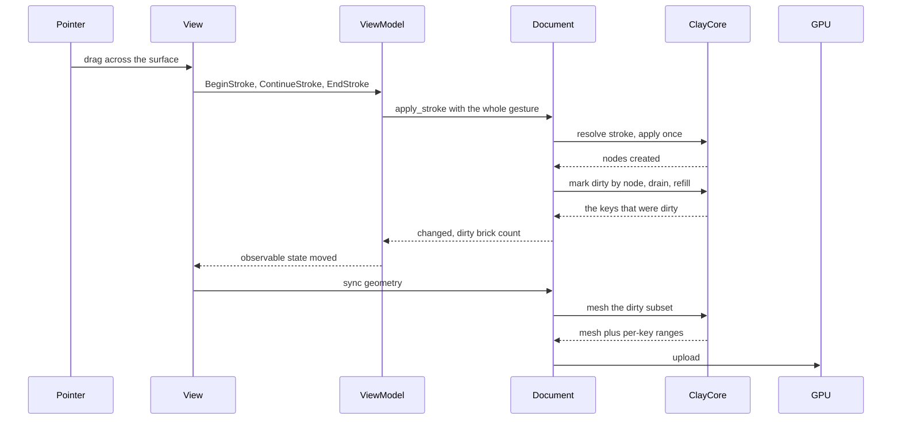

The whole gesture reaches the engine as one call, so the stroke engine decides
stamp spacing from arc length rather than from how many samples the device
happened to deliver — and so it undoes as one step.

Only the dirty subset is re-meshed. Details, and the three mistakes that made
the first version cost 267 ms, are in
[docs/architecture.md](docs/architecture.md).

### How a document is arranged

A document is a list of subtools. Each is a layer of its own and carries
everything that belongs to *that form* rather than to the scene.

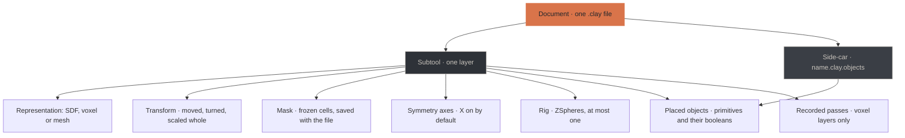

The side-car is why a `.clay` sent on its own still opens and sculpts with
every boolean intact — the hole a cylinder cut is still a hole — while none of
its shapes is offered as an object any more.

### What the pointer means

One button, several meanings, decided by what is under it and which mode is
open. This is the rule that lets a trackpad reach everything.

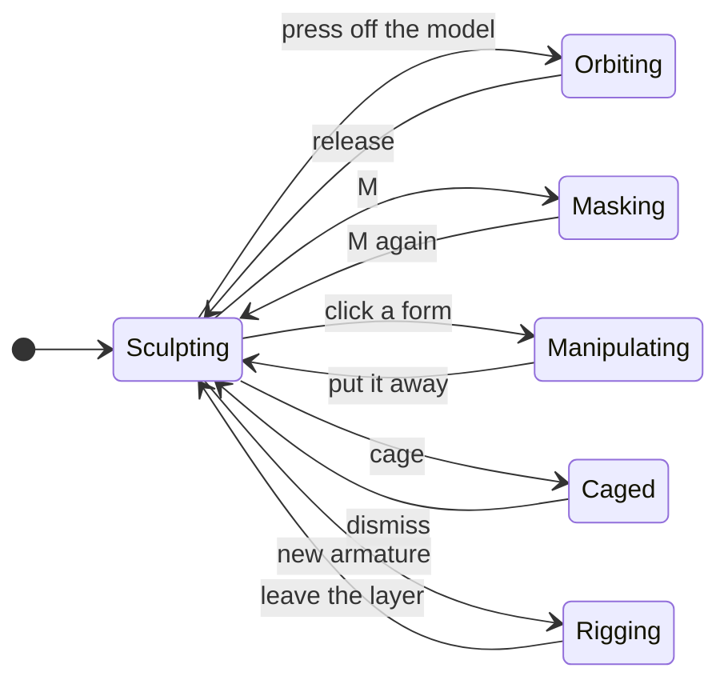

| Mode | A press means | Reached by |
|---|---|---|
| Sculpting | a dab with the active tool, or an orbit where it misses | the default |
| Orbiting | turn the camera | a press that lands off the model, right-drag, or Option-drag |
| Masking | paint, lasso or rectangle, freezing or thawing | `M`, or a gesture from the Masks menu |
| Manipulating | grab an arm, a ring or a box of the widget | clicking a form or a placed shape |
| Caged | drag a lattice point, with a manipulator on the selection | Dynamics → Deformation cage |
| Rigging | grow a sphere, insert a joint, move or resize one — and empty space still orbits | Sculpt → New armature |

### What a build actually does

`cargo build` compiles the C++ engine. That is the part worth knowing before
the first one takes a few minutes.

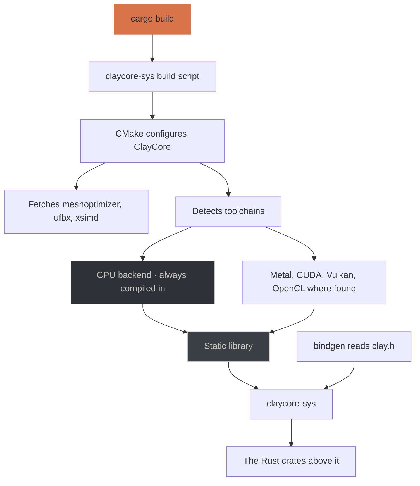

Naming a feature whose toolchain is missing is a **hard error** at configure
time, with the reason. Silently dropping it would produce a binary that cannot
register the backend you asked for. Later builds only recompile the engine when
the submodule's sources change.

---

## Prerequisites

| | Minimum | Why |
|---|---|---|
| Rust | 1.82 | workspace edition |
| CMake | 3.24 | ClayCore is a CMake project, built as part of `cargo build` |
| C++ compiler | C++20 | same |
| Network (first build only) | — | ClayCore fetches meshoptimizer, ufbx and xsimd at configure time |
| [`just`](https://github.com/casey/just) | optional | Every recipe has its `cargo` equivalent; `just` is convenience, not a dependency |

Accelerated backends are optional and detected automatically. macOS picks up
Metal from the Xcode command line tools; Linux picks up CUDA (`nvcc` on `PATH`
or `CUDA_PATH`) and Vulkan (`VULKAN_SDK`, or `pkg-config`). **The CPU backend is
always compiled in**, so a machine with none of them still builds and runs.

## Getting it

The engine is a submodule, pinned to an exact commit:

```sh
git clone --recurse-submodules https://github.com/CyberdyneCorp/ClaySpaceDesktop.git
cd ClaySpaceDesktop
just setup        # or: cargo build
```

Already cloned without it? `git submodule update --init --recursive`. Forgetting
this is the most likely first failure, and the build says so by name rather than
letting CMake or the linker produce a worse message.

The first build compiles the C++ engine and takes a few minutes. Later builds
only recompile it when the submodule's sources change.

## Common tasks

Everything routine is a [`just`](https://github.com/casey/just) recipe, so the
long-form commands live in one place. `just` on its own lists them.

| | |
|---|---|
| `just setup` | Fetch the pinned engine and build. What a fresh clone needs |
| `just run` | Open the application |
| `just run-cpu` | Open it with the CPU backend only, whatever the machine offers |
| `just test` | The whole suite, no display or GPU required |
| `just check` | Everything CI checks, in the order that fails fastest |
| `just visual` | Render every visual test and open the captures |
| `just bench` | The performance table: every brush, operation, conversion and bake |
| `just bench-only brush` | One group of it, for when the whole table is too long to wait for |
| `just bench-compare` | Against the recorded baseline — this is the CI gate |
| `just segments` | Per-segment cost of every brush, which is what a sculptor feels as lag |
| `just budget` | Where one stroke segment's milliseconds go |
| `just bundle` | The distributable: a `.app` on macOS, a tarball on Linux |
| `just engine` | Which ClayCore this build is pinned to |
| `just engine-pin v0.60.0` | Move the pin to a release tag |
| `just diagnostics` | What this build is and what it decided to run on |

`just check` runs six gates that are six different tools — formatting, the
layering rules, clippy, the suite, the specification and the packaging
scripts. Knowing to run all six should not depend on having read this file
recently.

## Testing

```sh
just test                         # the whole suite, no display or GPU required
just test-one visual_brushes      # one target, with output
```

Visual tests render real frames into `target/visual/`, and `just visual`
renders them all and opens the directory. The 658 captures there are how the
screenshots above were checked against what the tests assert.

These are meant to be looked at. Several real bugs were invisible to the
assertions and obvious in the picture — see
[docs/architecture.md](docs/architecture.md#what-the-captures-caught).

## Choosing backends explicitly

Detection is automatic, but can be overridden:

```sh
just run-cpu                                      # CPU only, any platform
CLAYCORE_CPU_ONLY=1 cargo build                   # the same, longhand
cargo build -p claycore --features metal          # require Metal
cargo build -p claycore --features cuda,vulkan    # require both
```

Note that CPU-only is an **environment variable and not a cargo feature**:
`CLAYCORE_CPU_ONLY` reaches the C++ configure step, which is where backends
are actually chosen. Every crate here declares `default = []`, so
`--no-default-features` would build exactly what a plain build does.

Backend choice affects speed, never results. The engine holds every GPU backend
to 1e-4 relative against the CPU scalar reference, and
`every_registered_backend_agrees_with_cpu` asserts it here too.

```sh
just diagnostics   # or: cargo run -p claycore --example diagnostics
```

```
engine version   : 0.73.0
expected ABI     : 0.73.0
compiled backends: metal
registered       : cpu, metal
```

Those two lines answer different questions. *Compiled* is what the build
selected; *registered* is what the engine found at runtime. A backend can be
compiled in and still fail to register, so only the second is trustworthy.

## Layout

```
crates/
  claycore-sys/      generated FFI to clay.h; no hand-written declarations
  claycore/          safe wrapper — the only crate that calls claycore-sys
  clayspace-model/   the domain: tools, interfaces, types. No engine dependency
  clayspace-engine/  the ClayCore-backed implementations of those interfaces
  clayspace-vm/      ViewModels: observable state + commands, no egui/wgpu
  clayspace-view/    widgets and renderer; cannot reach the engine at all
  clayspace-app/     composition root, window, event loop
benchmarks/          one recorded baseline per platform
docs/                architecture, features, roadmap, and the screenshots above
tools/               the layering check, packaging and attribution scripts
vendor/ClayCore/     the engine, pinned
openspec/            the specification this is built against
```

## Working on it

This project is specified before it is built. The specification lives in
`openspec/` and is the source of truth for what the application should do.

```sh
openspec list
openspec show add-clayspace-desktop
openspec validate --all --strict
```

Implementation follows the `tasks.md` under each change in
`openspec/changes/`. Behaviour changes go into the specification first.

## Documentation

| | |
|---|---|
| [docs/architecture.md](docs/architecture.md) | How the layers fit, and the decisions behind them |
| [docs/features.md](docs/features.md) | What works today, tool by tool |
| [docs/roadmap.md](docs/roadmap.md) | Milestones, what is left, open decisions |
| [ATTRIBUTION.md](ATTRIBUTION.md) | The dependency manifest, generated from `cargo metadata` |

The screenshots in this file live in `docs/images/`. They are of the running
application on Linux with the CUDA backend, against ClayCore 0.73.0, at a
1280×800 window. They are not the visual-test captures — those live in
`target/visual/` and are regenerated by `cargo test`.

## Licence

MIT. ClayCore is MIT with an all-permissive dependency manifest, so static
linking imposes no copyleft obligation.
