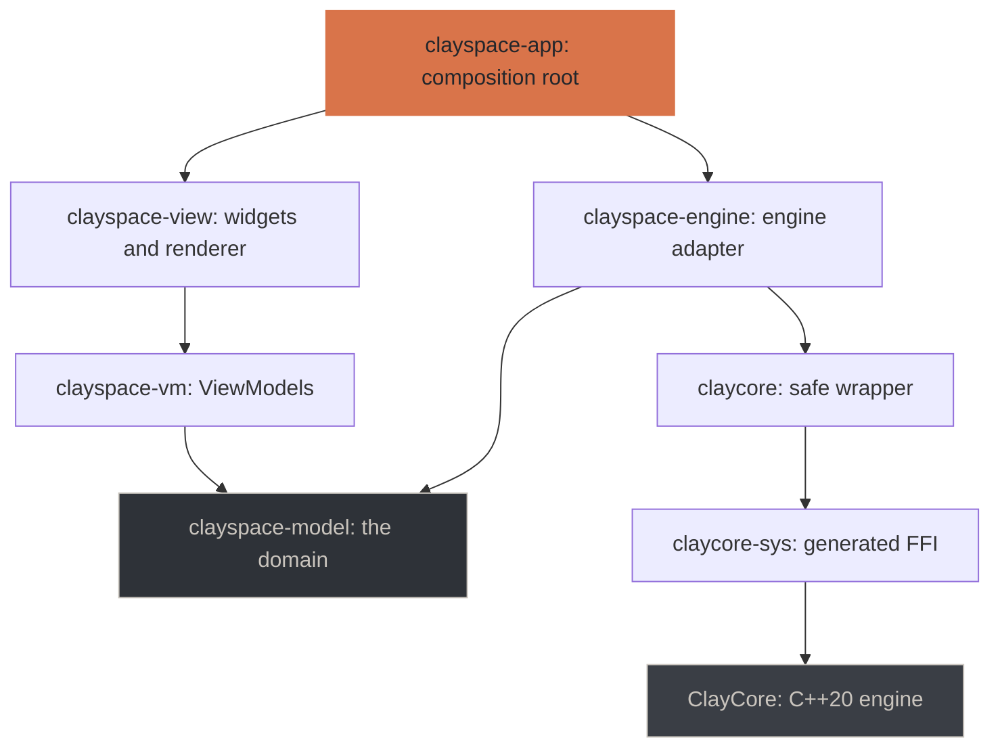
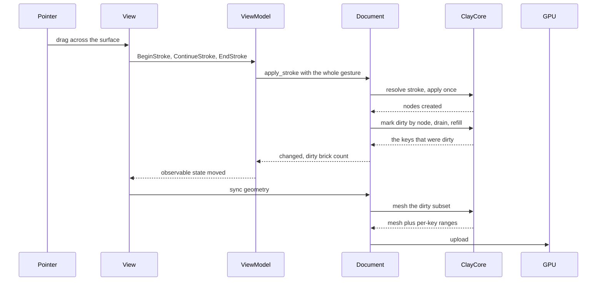

# ClaySpaceDesktop

A 3D sculpting desktop application in Rust, rendering with WebGPU and driving
the [ClayCore](https://github.com/CyberdyneCorp/ClayCore) SDF + voxel engine
through its C ABI. macOS and Linux.

**Status: you can sculpt, save, and open again.** Four of five milestones are
delivered; the fifth — masks, mesh I/O, packaging — is in progress. See
[docs/roadmap.md](docs/roadmap.md), which also lists what the engine currently
gets wrong and what that costs.

| | |
|---|---|
| Tests | 326, all headless |
| Visual captures | 154 PNGs, regenerated by `cargo test` |
| Dab latency | 15.8 ms median, 23.1 ms p95 (budget: 50 / 100) |
| | 81 ms on a heavily worked document — [ClayCore #73](https://github.com/CyberdyneCorp/ClayCore/issues/73) |
| Engine | ClayCore 0.27.3, pinned as a submodule |

## What it does today

```sh
cargo run -p clayspace-app
```

Opens a window on a starting form.

| Input | Action |
|---|---|
| Left-drag **on the model** | Sculpt with the active tool |
| Left-drag **off the model** | Orbit — ZBrush's rule, and the only one a trackpad can reach |
| Right-drag, or Option-drag | Orbit |
| Middle-drag | Pan |
| Wheel | Zoom |
| `1`–`4` | Perspectiva, Frontal, Lateral, Superior |
| `Z` / `R` | Undo / redo — one stroke is one undo |
| `X` `Y` | Symmetry (off by default; see the roadmap) |
| `[` `]` | Brush smaller / larger |
| `F` / `M` / `Esc` | Frame / cycle materials / quit |
| `⌘S` `⇧⌘S` `⌘O` `⌘N` | Save, save as, open, new |

Closing over unsaved edits asks first.

The full list of what works is in [docs/features.md](docs/features.md).

## Architecture

Five layers, with the dependency direction enforced by CI rather than by
review.



Two rules make this checkable rather than aspirational, and
`tools/check_layering.py` asserts both:

- **`clayspace-view` cannot reach the engine**, directly or transitively. A
  View reads ViewModel state and emits commands; it has no other way to affect
  anything.
- **`clayspace-vm` cannot reach `egui`, `wgpu` or `winit`**, so every ViewModel
  is exercised in a test with no window and no GPU.

The domain and the engine adapter are separate crates for exactly this reason:
a single crate holding both would put ClayCore in every layer's transitive
dependencies, and no arrangement of the others could satisfy the isolation
rule. A useful side effect is that the ViewModel tests run without compiling
the C++ engine at all.

`unsafe` lives in `claycore-sys` and `claycore` and nowhere else; every other
crate declares `#![forbid(unsafe_code)]`.

### What happens when you sculpt



The whole gesture reaches the engine as one call, so the stroke engine decides
stamp spacing from arc length rather than from how many samples the device
happened to deliver — and so it undoes as one step.

Only the dirty subset is re-meshed. Details, and the three mistakes that made
the first version cost 267 ms, are in
[docs/architecture.md](docs/architecture.md).

## Prerequisites

| | Minimum | Why |
|---|---|---|
| Rust | 1.82 | workspace edition |
| CMake | 3.24 | ClayCore is a CMake project, built as part of `cargo build` |
| C++ compiler | C++20 | same |
| Network (first build only) | — | ClayCore fetches meshoptimizer, ufbx and xsimd at configure time |

Accelerated backends are optional and detected automatically. macOS picks up
Metal from the Xcode command line tools; Linux picks up CUDA (`nvcc` on `PATH`
or `CUDA_PATH`) and Vulkan (`VULKAN_SDK`, or `pkg-config`). **The CPU backend is
always compiled in**, so a machine with none of them still builds and runs.

## Getting it

The engine is a submodule, pinned to an exact commit:

```sh
git clone --recurse-submodules https://github.com/CyberdyneCorp/ClaySpaceDesktop.git
cd ClaySpaceDesktop
cargo build
```

Already cloned without it? `git submodule update --init --recursive`. Forgetting
this is the most likely first failure, and the build says so by name rather than
letting CMake or the linker produce a worse message.

The first build compiles the C++ engine and takes a few minutes. Later builds
only recompile it when the submodule's sources change.

## Testing

```sh
cargo test --workspace            # 326 tests, no display or GPU required
python3 tools/check_layering.py   # the architecture rules
openspec validate --all --strict  # the specification
```

Visual tests render real frames and write them to `target/visual/`:

```sh
cargo test -p clayspace-app --test visual_rendering   # shading, camera, overlays
cargo test -p clayspace-app --test visual_sculpting   # every tool, before and after
cargo test -p clayspace-app --test visual_shell       # the interface
open target/visual
```

These are meant to be looked at. Four real bugs so far were invisible to the
assertions and obvious in the picture — see
[docs/architecture.md](docs/architecture.md#what-the-captures-caught).

## Choosing backends explicitly

Detection is automatic, but can be overridden:

```sh
cargo build --no-default-features                 # CPU only, any platform
cargo build -p claycore --features metal          # require Metal
cargo build -p claycore --features cuda,vulkan    # require both
```

Naming a feature whose toolchain is missing is a **hard error** at configure
time, with the reason. Silently dropping it would produce a binary that cannot
register the backend you asked for.

Backend choice affects speed, never results. The engine holds every GPU backend
to 1e-4 relative against the CPU scalar reference, and
`every_registered_backend_agrees_with_cpu` asserts it here too.

```sh
cargo run -p claycore --example diagnostics
```

```
engine version   : 0.26.0
expected ABI     : 0.26.0
compiled backends: metal
registered       : cpu, metal
```

Those two lines answer different questions. *Compiled* is what the build
selected; *registered* is what the engine found at runtime. A backend can be
compiled in and still fail to register, so only the second is trustworthy.

## Layout

```
crates/
  claycore-sys/      generated FFI to clay.h; no hand-written declarations
  claycore/          safe wrapper — the only crate that calls claycore-sys
  clayspace-model/   the domain: tools, interfaces, types. No engine dependency
  clayspace-engine/  the ClayCore-backed implementations of those interfaces
  clayspace-vm/      ViewModels: observable state + commands, no egui/wgpu
  clayspace-view/    widgets and renderer; cannot reach the engine at all
  clayspace-app/     composition root, window, event loop
docs/                architecture, features, roadmap
tools/               the layering check
vendor/ClayCore/     the engine, pinned
openspec/            the specification this is built against
```

## Working on it

This project is specified before it is built. The specification lives in
`openspec/` and is the source of truth for what the application should do.

```sh
openspec list
openspec show add-clayspace-desktop
openspec validate --all --strict
```

Implementation follows `openspec/changes/add-clayspace-desktop/tasks.md`.
Behaviour changes go into the specification first.

## Documentation

| | |
|---|---|
| [docs/architecture.md](docs/architecture.md) | How the layers fit, and the decisions behind them |
| [docs/features.md](docs/features.md) | What works today, tool by tool |
| [docs/roadmap.md](docs/roadmap.md) | Milestones, what is left, open decisions |

## Licence

MIT. ClayCore is MIT with an all-permissive dependency manifest, so static
linking imposes no copyleft obligation.
