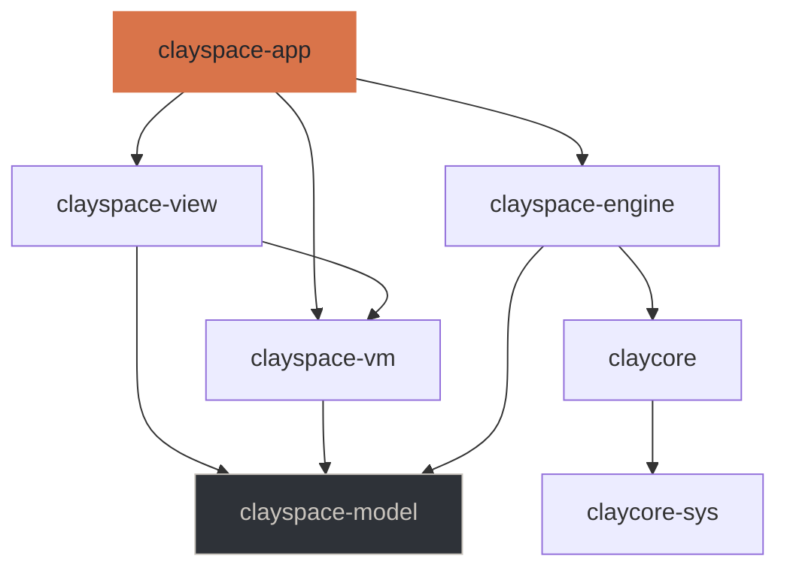
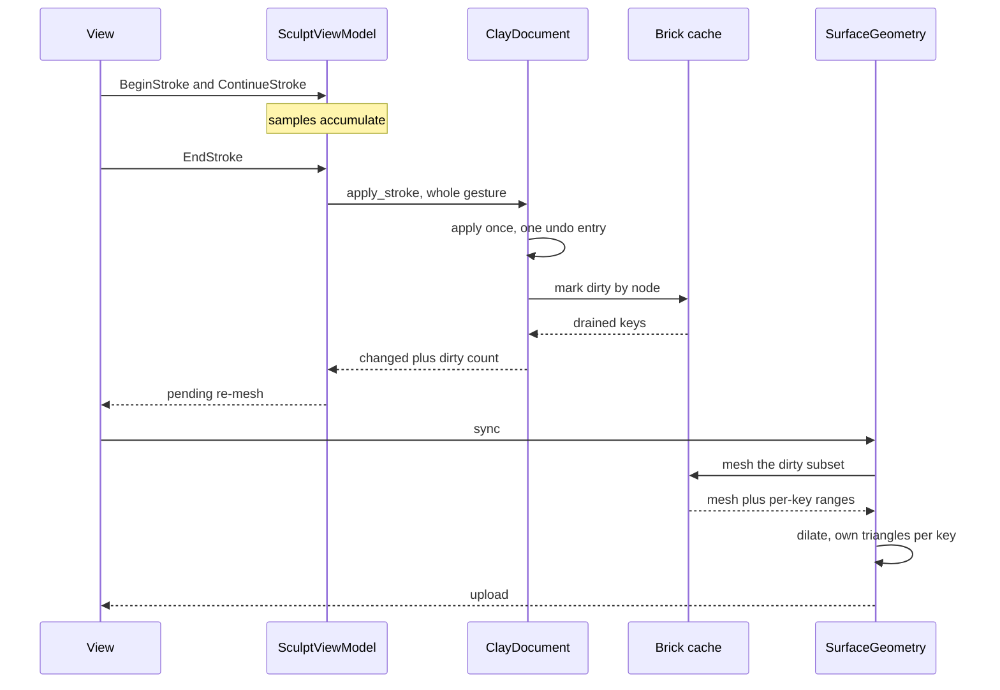
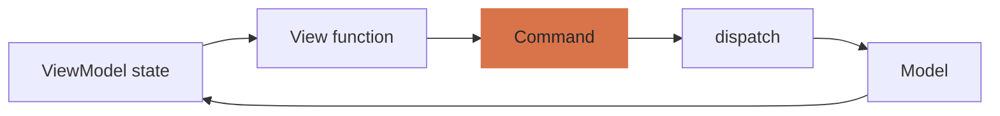

# Architecture

How the layers fit together, and why they are arranged this way. The
specification in `openspec/` says *what* the application must do; this says how
it is built and which decisions were forced rather than chosen.

## The engine underneath

ClayCore is a headless C++20 library with a stable C ABI — about 190 entry
points covering document and layer authoring, the stroke engine, voxel grids
and their sculpting verbs, mask fields, the brick cache, picking, meshing,
evaluation and file I/O. Three of its properties shape everything above.

**Backends are runtime-registered and parity-gated.** CPU is compiled in
unconditionally and *defines correctness*; Metal, Vulkan, CUDA and OpenCL
register only where available and are held to 1e-4 relative on distances
against the CPU scalar reference. So this application never writes a backend
abstraction — it writes a *policy* over one that already exists.

**The kernel dialect targets MSL, CUDA C, OpenCL C and C++ — not WGSL.** The
viewport therefore renders meshes the engine produced rather than evaluating
the field in a shader. This is not a limitation worked around; it is the
protection against a specific bug ClayCore documents having already shipped
once, where a hand-written Metal preview used a smooth-minimum of support `k`
where the engine used `4k`, making every blend four times narrower than the
real field.

**The C ABI states its threading contract.** A document is safe to read from
several threads at once; calls on one mutable handle are the host's to
serialise; batched evaluation is free-threaded against a const document. The
safe wrapper expresses this as `Send + !Sync` with a snapshot reader, so a
concurrent mutation is a borrow-check error rather than a race.

## The layers

| Crate | Holds | Must not reach |
|---|---|---|
| `claycore-sys` | Generated FFI. No hand-written declarations | — |
| `claycore` | Safe wrapper: ownership, errors, threading | — |
| `clayspace-model` | The domain: tools, interfaces, types | ClayCore |
| `clayspace-engine` | ClayCore-backed implementations | — |
| `clayspace-vm` | ViewModels: observable state and commands | egui, wgpu, winit, ClayCore |
| `clayspace-view` | Widgets and the renderer | ClayCore, directly or transitively |
| `clayspace-app` | Composition root, window, event loop | — |

`unsafe` exists in the two bridge crates and nowhere else. Every other crate
declares `#![forbid(unsafe_code)]`, and `tools/check_layering.py` fails if one
drops the declaration or if any forbidden dependency edge appears.

### Why the domain and the adapter are separate

The first arrangement put both in `clayspace-model`. The layering check failed
on its first run: `view → vm → model → claycore` reaches the engine
transitively, which the isolation rule forbids. There is no arrangement of the
remaining crates that fixes that while the domain and engine access share one,
so they were split.

The benefit is not only purity. The ViewModel tests build and run without
compiling the C++ engine, which is the difference between a fast feedback loop
and a slow one.

## What the safe wrapper adds

The C header states its contracts in prose. The wrapper turns them into things
the compiler enforces.

**Ownership.** A voxel grid or mask created standalone is owned and released on
drop; one lent by a document is a *different type*, lifetime-bound to it, with
no destroy operation at all. The engine documents destroying a borrowed handle
as an error; here it does not compile.

**Errors.** Every `clay_result` becomes a `Result`, carrying the engine's
thread-local detail message read *at the point of failure* — before another
call can overwrite it.

**Buffers.** The size-query protocol is wrapped once rather than at each of the
dozens of call sites that use it.

One entry point is emphatically not a size-query call, and treating it as one
applied every stroke twice:

> This is NOT a size-query call: it applies the stroke exactly once, however it
> is called.

The node buffer is sized with `clay_stroke_resolve`, which is pure and
documented for exactly this.

## The sculpting path

Four properties are load-bearing:

**The whole gesture arrives at once.** The stroke engine then decides stamp
spacing from arc length rather than from how many samples the device delivered,
and the stroke undoes as one step.

**Dirty is marked by node, not by layer.** A layer's extent is the union of
everything in it; for content spread apart that spans more bricks than any
cache can hold, and the engine refuses such a region. Marking by node bounds
the work to the edit's influence.

**The dirty set comes from the cache's drain.** Diffing surface bricks before
and after finds nothing new after the initial fill, so it falls back to
everything.

**The dirty set is dilated by face neighbours.** A key meshed alone regenerates
the triangles on its boundary while its neighbour still holds the previous
version of the same seam, which shows as a thin crack tracing the edit.

### Getting inside the budget

The specification allows 50 ms median and 100 ms at the 95th percentile from
input to visible. Reaching it took three corrections and one admission:

| Change | Keys per dab | Median |
|---|---|---|
| First version: diff surface bricks | 1043 | 267 ms |
| Take the dirty set from the cache drain | 27 | 26 ms |
| Dilate by face neighbours, to close seams | 81 | 66 ms |
| A realistic brush radius | 32 | **31 ms** |

The last row is the admission. `BrushSettings` defaulted to a radius of `0.38`
because the design's tool bar reads *"Tamanho 38 px"*. Pixels are a screen
measure that maps through the zoom; taken as world units that is a brush
covering a third of a unit-sized model. A detail brush at `0.08` is what the
number means at a normal framing.

16-cell bricks were also tried, and are worse: a third as many keys but eight
times the cells each, so a dilated set meshes more overall — 64 ms against 39.

### A known cost

Assembly is concatenation rather than sub-range patching, because the engine
welds vertices across brick seams and a key's range cannot be relocated
independently. Meshing is the cost the engine bounds and this does not repeat
it, but the upload is a full memcpy — 11 ms at the current model size, and it
grows with the model. If it becomes the bottleneck, that is where to look.

## MVVM, mechanically

A View function is a pure function of ViewModel state that emits commands. It
cannot mutate, call the Model, or perform I/O — and cannot reach the engine to
try.

Commands are values rather than closures, so a menu item, a keyboard shortcut
and a panel button that mean the same thing emit the *same* command and cannot
drift apart. `Command::touches_document` decides in one place that view
changes never enter the undo history.

Observable state carries a revision. Reading never marks anything dirty, and
setting a control to the value it already holds is not a change — which matters
because an immediate-mode interface does both constantly.

Work that outlasts a frame goes to a job runner that never blocks the interface
thread and discards a result whose generation is behind the current one. A
stale export writing itself over a newer document is the failure that exists to
prevent.

## Testing

| Kind | Where | What it checks |
|---|---|---|
| Bridge | `claycore/tests` | Authoring, meshing, picking, save and reload against every registered backend |
| Domain | `clayspace-model` | Tool availability, brush clamping, protection states |
| ViewModel | `clayspace-vm/tests` | The interface rules, against a double, with no engine |
| Session | `clayspace-engine/tests` | The same rules against a real document |
| Latency | `clayspace-app/tests` | Dab cost against the budget |
| Visual | `clayspace-app/tests` | Real frames, written as PNGs |

The visual tests are the unusual ones. They render a real frame on a real
device and write it to `target/visual/`, with assertions deliberately coarse —
"something was drawn", "these two differ", "this is dimmer than that" — because
a pixel-exact golden would fail on every driver and say nothing about whether
the picture is right.

### What the captures caught

Four bugs that the assertions passed straight over:

**Overlays rendered fully transparent.** The overlay shader took its alpha from
the material uniform's alpha channel, which carries the vertex-colour flag for
the surface pipeline and means nothing for a line.

**Overlays then rendered several times too bright**, competing with the
silhouette they are meant to sit behind. The design's hex palette was written
straight into an sRGB target as if it were linear.

**A crack along every brick boundary.** Per-key geometry stored only a key's
own vertex range and dropped triangles reaching outside it — but the engine
welds across seams, so a great many do. The capture showed a grid of holes; no
key count or timing would have named it.

**A stroke that deposited four specks.** Its stamps sat inside a radius-1 ball
and were swallowed by it.

A fifth was caught by running the app rather than the tests: the window aborted
on its first presented frame because the surface and the device came from two
different `wgpu::Instance`s. The offscreen tests never build a surface, so they
structurally could not have found it. `window_smoke` now requires three
presented frames and has been verified against the regression.

## Decisions recorded elsewhere

`openspec/changes/add-clayspace-desktop/design.md` carries the full decision
record, including the alternatives considered. The ones most likely to be
revisited:

- **Meshing rather than a brick-volume raymarch** for the viewport. The volume
  path needs no kernel math in the shader and removes meshing from the
  interaction path; it is the first thing to try if meshing dominates.
- **No GPU device injection.** ClayCore 0.26.0 offers it, but the device path
  bypasses the brick cache, so taking it means reimplementing generations,
  staleness, quantization and the memory budget. A bounded copy is cheaper for
  now.
- **No soft-body dynamics.** The design's *Dinâmica* panel shows gravity,
  rigidity and damping; ClayCore has no solver and none is planned.
