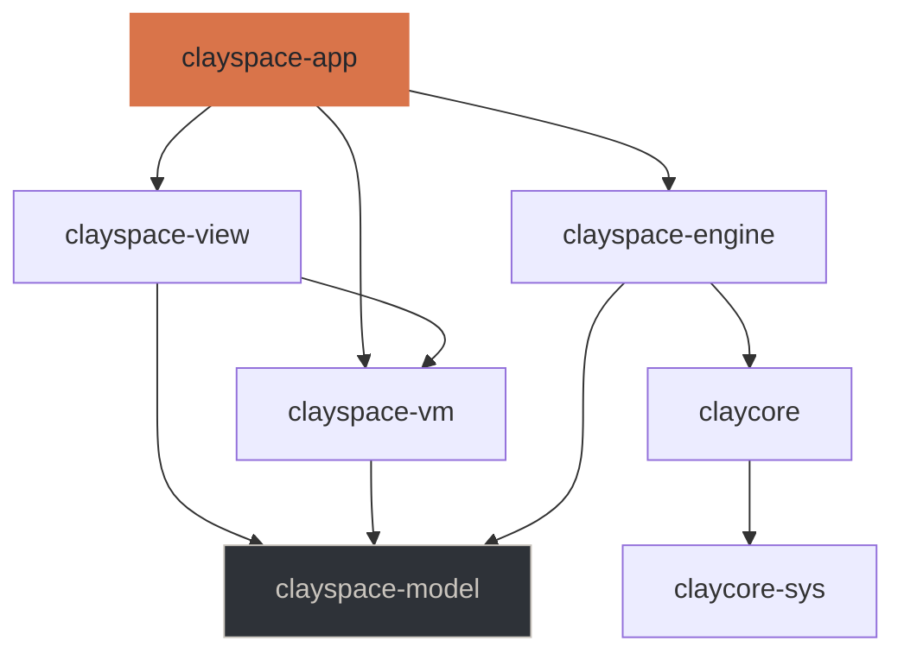
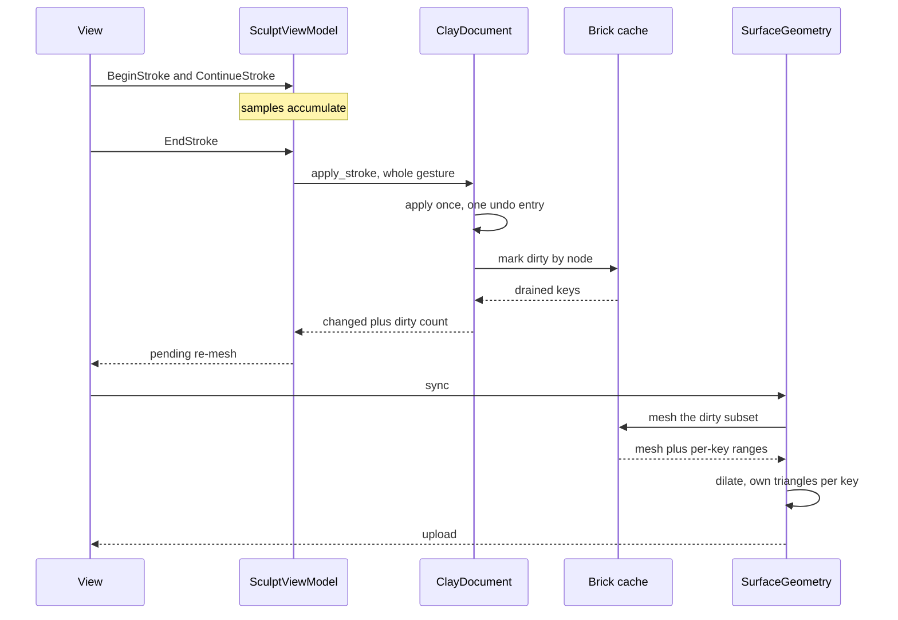
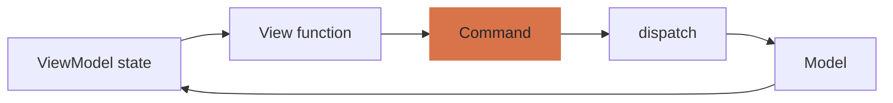

# Architecture

How the layers fit together, and why they are arranged this way. The
specification in `openspec/` says *what* the application must do; this says how
it is built and which decisions were forced rather than chosen.

## The engine underneath

ClayCore is a headless C++20 library with a stable C ABI — about 190 entry
points covering document and layer authoring, the stroke engine, voxel grids
and their sculpting verbs, mask fields, the brick cache, picking, meshing,
evaluation and file I/O. Three of its properties shape everything above.

**Backends are runtime-registered and parity-gated.** CPU is compiled in
unconditionally and *defines correctness*; Metal, Vulkan, CUDA and OpenCL
register only where available and are held to 1e-4 relative on distances
against the CPU scalar reference. So this application never writes a backend
abstraction — it writes a *policy* over one that already exists.

**There is one implementation of every distance function and operator, and it
is the engine's.** The viewport renders meshes the engine produced rather than
evaluating the field itself. This is not a limitation worked around; it is the
protection against a specific bug ClayCore documents having already shipped
once, where a hand-written Metal preview used a smooth-minimum of support `k`
where the engine used `4k`, making every blend four times narrower than the
real field.

Two routes keep that promise, and the difference matters because only one of
them is closed to us. Compiling ClayCore's kernels into our own shader is not
available: the dialect targets MSL, CUDA C, OpenCL C and C++, and not WGSL.
Uploading what the engine already computed *is* available in any shading
language, and is the route ClayCore recommends for a host with no need for the
field between samples — it was proposed from this repository as ClayCore #43
and has been complete since ABI 0.25.0. So the rule above is about *whose
arithmetic decides where the surface is*, not about which pixels we are allowed
to draw. Anything the engine hands over already evaluated — a brick lattice, a
mesh, a lattice displacement — is ours to draw, and a live brush preview is
drawn that way rather than being withheld until the gesture ends.

**The C ABI states its threading contract.** A document is safe to read from
several threads at once; calls on one mutable handle are the host's to
serialise; batched evaluation is free-threaded against a const document. The
safe wrapper expresses this as `Send + !Sync` with a snapshot reader, so a
concurrent mutation is a borrow-check error rather than a race.

## The layers

| Crate | Holds | Must not reach |
|---|---|---|
| `claycore-sys` | Generated FFI. No hand-written declarations | — |
| `claycore` | Safe wrapper: ownership, errors, threading | — |
| `clayspace-model` | The domain: tools, interfaces, types | ClayCore |
| `clayspace-engine` | ClayCore-backed implementations | — |
| `clayspace-vm` | ViewModels: observable state and commands | egui, wgpu, winit, ClayCore |
| `clayspace-view` | Widgets and the renderer | ClayCore, directly or transitively |
| `clayspace-app` | Composition root, window, event loop | — |

`unsafe` exists in the two bridge crates and nowhere else. Every other crate
declares `#![forbid(unsafe_code)]`, and `tools/check_layering.py` fails if one
drops the declaration or if any forbidden dependency edge appears.

### Why the domain and the adapter are separate

The first arrangement put both in `clayspace-model`. The layering check failed
on its first run: `view → vm → model → claycore` reaches the engine
transitively, which the isolation rule forbids. There is no arrangement of the
remaining crates that fixes that while the domain and engine access share one,
so they were split.

The benefit is not only purity. The ViewModel tests build and run without
compiling the C++ engine, which is the difference between a fast feedback loop
and a slow one.

## What the safe wrapper adds

The C header states its contracts in prose. The wrapper turns them into things
the compiler enforces.

**Ownership.** A voxel grid or mask created standalone is owned and released on
drop; one lent by a document is a *different type*, lifetime-bound to it, with
no destroy operation at all. The engine documents destroying a borrowed handle
as an error; here it does not compile.

**Errors.** Every `clay_result` becomes a `Result`, carrying the engine's
thread-local detail message read *at the point of failure* — before another
call can overwrite it.

**Buffers.** The size-query protocol is wrapped once rather than at each of the
dozens of call sites that use it.

One entry point is emphatically not a size-query call, and treating it as one
applied every stroke twice:

> This is NOT a size-query call: it applies the stroke exactly once, however it
> is called.

The node buffer is sized with `clay_stroke_resolve`, which is pure and
documented for exactly this.

## The sculpting path

Four properties are load-bearing:

**The whole gesture arrives at once.** The stroke engine then decides stamp
spacing from arc length rather than from how many samples the device delivered,
and the stroke undoes as one step.

**Dirty is marked by node, not by layer.** A layer's extent is the union of
everything in it; for content spread apart that spans more bricks than any
cache can hold, and the engine refuses such a region. Marking by node bounds
the work to the edit's influence.

**The dirty set comes from the cache's drain.** Diffing surface bricks before
and after finds nothing new after the initial fill, so it falls back to
everything.

**The dirty set is dilated by face neighbours.** A key meshed alone regenerates
the triangles on its boundary while its neighbour still holds the previous
version of the same seam, which shows as a thin crack tracing the edit.

### Getting inside the budget

The specification allows 50 ms median and 100 ms at the 95th percentile from
input to visible. Reaching it took three corrections and one admission:

| Change | Keys per dab | Median |
|---|---|---|
| First version: diff surface bricks | 1043 | 267 ms |
| Take the dirty set from the cache drain | 27 | 26 ms |
| Dilate by face neighbours, to close seams | 81 | 66 ms |
| A realistic brush radius | 32 | **31 ms** |

The last row is the admission. `BrushSettings` defaulted to a radius of `0.38`
because the design's tool bar reads *"Tamanho 38 px"*. Pixels are a screen
measure that maps through the zoom; taken as world units that is a brush
covering a third of a unit-sized model. A detail brush at `0.08` is what the
number means at a normal framing.

### What the gate measures

`just bench` measures one figure group per operation a sculptor can invoke —
every brush on every representation it has a verb for, the layer operations,
rigging and curves, placing and dragging an object, the six conversions,
consolidation, export, pre-bake repair, mask gating, undo and redo — beside the
five the specification puts a budget on. The coverage is derived rather than listed: the brush loop is
`Representation::ALL` against `ToolKind::for_representation`, which is the
table the shelf itself presents from, so a tool added to the shelf is a tool
measured.

Three things make the record trustworthy rather than merely present:

- **A reference suite, revisioned per member.** One scene per representation,
  plus the ten-times variant for locality and a deliberately damaged grid for
  the repairs. Each names its own revision in the baseline's `conditions`, and
  a comparison against a baseline recorded on a different revision is refused
  and says which member changed. `reference_suite.rs` checks each member still
  builds the size its revision claims.
- **A figure that stops being measured fails the gate.** A measurement that
  quietly returns early looks exactly like one that did not regress, which is
  the thing a performance gate exists to catch. So a measurement says *why* it
  could not run — no headless GPU, a tool with no gesture this harness can
  synthesise — and a baseline figure that is neither measured nor accounted for
  is reported as missing and fails.
- **Figures are reported, not asserted.** Only the specification's five carry
  budgets. Everything else is a tracked quantity compared against the recorded
  baseline; a new figure is not a new promise.

The whole suite is long enough to be worth filtering: `just bench-only brush`
measures one group. A filtered run cannot record a baseline, since a baseline
recorded from a subset reports every omitted figure as missing on the next
comparison.

**A figure carries the machine it was measured on.** The one-minute load is
sampled before the warm-up — after that the load is mostly the benchmark, which
says nothing about who else is competing — reported per core, and written into
the baseline's `conditions`. Above half a runnable thread per core the run
refuses to record a baseline unless `--allow-busy` is passed: a noisy
comparison is wrong once, a noisy baseline is wrong for every run that comes
after it. Both directions are caveated when a comparison goes red, because a
baseline recorded on a loaded box makes every honest run afterwards look like a
regression.

The thresholds are measured rather than chosen. On the reference machine a
concurrent test suite and database — about 0.2 per core — left the move-brush
figure inside 2% across three runs, while an unrelated process at roughly 0.6
per core moved a single measurement by 25%, several times the gate's tolerance.

16-cell bricks were also tried, and are worse: a third as many keys but eight
times the cells each, so a dilated set meshes more overall — 64 ms against 39.

### Two costs that were paid per model rather than per edit

Both are gone, and both had been sitting behind a correct-looking incremental
path. A dab dirties about 27 bricks; before these, it re-meshed 200 and
rewrote the whole GPU buffer.

**The dilation ring.** The dirty bricks used to be dilated by one before
meshing, because a subset mesh omitted triangles straddling its boundary and
left seams. ClayCore 0.28.0 fixed that (#66) — a subset now returns every
triangle with a corner in a requested brick — and the ring stayed on out of
habit. Removing it changed nothing a rebuild comparison can see and cut the
keys per dab from 200 to 27.

**Whole-buffer upload.** Assembly used to be concatenation, on the grounds
that the engine welds vertices across brick seams so a key's range cannot move
independently. That is true of the engine's output and not of ours: the
per-key split gives every key its own local vertex table, so a key's geometry
is self-contained and its span can be placed anywhere. Each key now keeps a
span in both buffers (`clayspace-app/src/slots.rs`) and a dab writes only the
spans it touched.

Spans carry a quarter of headroom so a brick re-meshing slightly larger stays
put; one that outgrows its span is re-homed at the end and the abandoned
indices are filled with degenerate triangles, since the surface is a single
draw call over a single range. Holes accumulate, so the whole surface is laid
out again once a fifth of the drawn range is holes.

Index spans are rounded to a multiple of three. The rasteriser groups indices
into triangles by position from the start of the draw range and knows nothing
about spans, so a span ending mid-triangle re-cuts every triangle after it —
which renders as speckle over the entire model rather than damage anywhere
nameable.

A median dab, at 286k triangles:

| stage | before | after |
| --- | --- | --- |
| keys re-meshed | 200 | 27 |
| engine: apply stroke + refill | 0.7 ms | 0.6 ms |
| engine: brick cache mesh | 5.8 ms | 1.8 ms |
| ours: copy into vertex layout | 0.1 ms | 0.1 ms |
| ours: split into per-key geometry | 2.2 ms | 0.5 ms |
| ours: write to the GPU | 3.1 ms | 0.2 ms |
| **total** | **12.0 ms** | **3.1 ms** |

The upload is now the smallest term and no longer scales with the model, which
is the property that matters: it is the edit that is paid for, not the sculpt.
`dab_profile.rs` fails if it ever dominates again.

## MVVM, mechanically

A View function is a pure function of ViewModel state that emits commands. It
cannot mutate, call the Model, or perform I/O — and cannot reach the engine to
try.

Commands are values rather than closures, so a menu item, a keyboard shortcut
and a panel button that mean the same thing emit the *same* command and cannot
drift apart. `Command::touches_document` decides in one place that view
changes never enter the undo history.

Observable state carries a revision. Reading never marks anything dirty, and
setting a control to the value it already holds is not a change — which matters
because an immediate-mode interface does both constantly.

Work that outlasts a frame goes to a job runner that never blocks the interface
thread and discards a result whose generation is behind the current one. A
stale export writing itself over a newer document is the failure that exists to
prevent.

## Testing

| Kind | Where | What it checks |
|---|---|---|
| Bridge | `claycore/tests` | Authoring, meshing, picking, save and reload against every registered backend |
| Domain | `clayspace-model` | Tool availability, brush clamping, protection states |
| ViewModel | `clayspace-vm/tests` | The interface rules, against a double, with no engine |
| Session | `clayspace-engine/tests` | The same rules against a real document |
| Latency | `clayspace-app/tests` | Dab cost against the budget |
| Performance | `clayspace-app/src/bin/bench` | Every operation a sculptor can invoke, against a recorded baseline |
| Visual | `clayspace-app/tests` | Real frames, written as PNGs |

### A fixture that cannot be built is a failure, not a skip

The session tests used to open with `let Some(mut document) = document() else {
return; };`, and the helper behind it swallowed every error with `.ok()?`. A
regression in `ClayDocument::new` or `with_starting_form` therefore turned whole
files green while asserting nothing — measured: breaking `with_starting_form`
left `curve.rs` reporting 11 passed. They now build with `.expect`, so the same
break fails all eleven and names the call that could not be made.

The distinction is what the failure would mean. `BackendPolicy::discover` cannot
fail for want of a candidate and a CPU document always builds, so a refusal
there is a bug and must be loud. A machine with no accelerated backend, or no
window server, is a fact about the machine: those tests still return early, and
`window_smoke` turns its skip into a panic when `CLAYSPACE_REQUIRE_WINDOW` is
set.

The visual tests are the unusual ones. They render a real frame on a real
device and write it to `target/visual/`, with assertions deliberately coarse —
"something was drawn", "these two differ", "this is dimmer than that" — because
a pixel-exact golden would fail on every driver and say nothing about whether
the picture is right.

### What the captures caught

Four bugs that the assertions passed straight over:

**Overlays rendered fully transparent.** The overlay shader took its alpha from
the material uniform's alpha channel, which carries the vertex-colour flag for
the surface pipeline and means nothing for a line.

**Overlays then rendered several times too bright**, competing with the
silhouette they are meant to sit behind. The design's hex palette was written
straight into an sRGB target as if it were linear.

**A crack along every brick boundary.** Per-key geometry stored only a key's
own vertex range and dropped triangles reaching outside it — but the engine
welds across seams, so a great many do. The capture showed a grid of holes; no
key count or timing would have named it.

**A stroke that deposited four specks.** Its stamps sat inside a radius-1 ball
and were swallowed by it.

A fifth was caught by running the app rather than the tests: the window aborted
on its first presented frame because the surface and the device came from two
different `wgpu::Instance`s. The offscreen tests never build a surface, so they
structurally could not have found it. `window_smoke` now requires three
presented frames and has been verified against the regression.

## Decisions recorded elsewhere

`openspec/changes/add-clayspace-desktop/design.md` carries the full decision
record, including the alternatives considered. The ones most likely to be
revisited:

- **Meshing rather than a brick-volume raymarch** for the viewport. The volume
  path needs no kernel math in the shader and removes meshing from the
  interaction path; it is the first thing to try if meshing dominates.
- **No GPU device injection.** ClayCore 0.26.0 offers it, but the device path
  bypasses the brick cache, so taking it means reimplementing generations,
  staleness, quantization and the memory budget. A bounded copy is cheaper for
  now.
- **No soft-body dynamics.** The design's *Dinâmica* panel shows gravity,
  rigidity and damping; ClayCore has no solver and none is planned.
