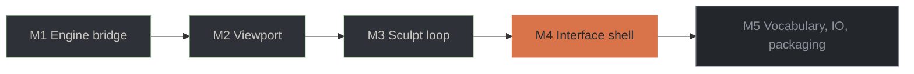

# Roadmap

Where the project stands, what is left, and what is still undecided. Task
counts come from `openspec/changes/add-clayspace-desktop/tasks.md`, which is
the authority.

**59 of 109 tasks. Milestones 1 to 3 delivered; milestone 4 in progress.**

## Milestones

| | Milestone | State | What it means |
|---|---|---|---|
| M1 | Engine bridge | Delivered | Submodule, CMake build, generated FFI, safe wrapper, verified against every registered backend |
| M2 | Viewport | Delivered | Window, wgpu device, MatCap, camera, overlays, gizmo, device-loss recovery |
| M3 | Sculpt loop | Delivered | Stroke capture, incremental re-mesh inside the latency budget, brush cursor, undo |
| M4 | Interface shell | **In progress** | Panels, scene tree, layer stack, inspectors, design system |
| M5 | Vocabulary, I/O, packaging | Planned | Masks and armatures, documents, performance gates, bundles |

## Task groups

| Group | Milestone | Done |
|---|---|---|
| 1 · Workspace and engine bridge | M1 | 16/16 |
| 2 · Acceleration policy | M1 | 5/7 |
| 3 · Rendering foundation | M2 | 8/9 |
| 4 · MVVM skeleton | M3 | 7/7 |
| 5 · Sculpting loop | M3 | 11/11 |
| 6 · Masks and armatures | M5 | 0/6 |
| 7 · Scene, layers and history | M4 | 0/13 |
| 8 · Document lifecycle | M5 | 0/8 |
| 9 · Interface shell and design system | M4 | 11/16 |
| 10 · Performance and packaging | M5 | 0/13 |
| 11 · Close-out | M5 | 1/3 |

A delivered milestone need not show a full bar. Groups 2 and 3 each carry
tasks deliberately deferred to later work rather than skipped:

- **2.6, 2.7 — backend diagnostics and its test.** They need somewhere to live,
  which is the shell.
- **3.9 — level of detail over brick mips.** Needs a viewport reading bricks
  rather than meshes.

## What is left in milestone 4

**Group 7 — scene, layers and history (13).** The panels currently read a
fixture. Wiring them to the live document means layer creation, renaming,
reordering and removal as undoable steps, the three protection states enforced
on edits, selection through the engine's attributed raycast, the field report
and consolidation flow, and a history panel that can be navigated.

**Group 9 — the remaining five.** An icon set at one stroke weight; panel
resize, collapse and layout persistence; remappable shortcuts with conflict
reporting; budget-exhaustion handling that leaves the document intact; and
error presentation near the action that failed.

## Milestone 5

| Group | Work |
|---|---|
| 6 | Mask painting through the stroke engine, expand and contract, mask extrude, armature authoring |
| 8 | `.clayspace` open and save, mesh import and export, autosave and crash recovery, recent files, units |
| 10 | The reference scene, the benchmark harness as a CI gate, build features, the CI matrix, bundles, attribution |
| 11 | Resolving the open decisions below, then archiving the change |

## Open decisions

These change what gets built, and are better settled early than late.

**The Dinâmica panel.** The design shows gravity at −9.81, rigidity and
damping. ClayCore has no solver and its roadmap proposes none. The panel
currently ships as voxel size and the multi-resolution level stack, which is
what "Dinâmica: Ligada" means operationally. Confirm that, or scope soft-body
simulation as its own research-sized change with no engine support behind it.

**Localisation scope.** The design is Portuguese throughout. Both pt-BR and
en-US are carried today, so the fallback path is exercised rather than assumed.
Shipping one or both is a product decision, not an architectural one.

**Default representation.** A new document currently opens SDF-first. Several
verbs exist on one representation only, so this decides what the first minute
of the application feels like.

## Known costs and escape routes

**The mesh upload is a full memcpy.** 11 ms at the current model size, growing
with the model. Meshing is bounded; the upload is not. If it becomes the
bottleneck, sub-range patching needs the weld problem solved, or the
brick-volume viewport removes the question.

**The viewport meshes rather than raymarching bricks.** The volume path needs
no kernel math in a shader and takes meshing off the interaction path entirely.
It is the recorded escape route if the latency budget comes under pressure, and
it is what ClayCore's own `docs/06` recommends for most hosts.

**GPU device injection is available and not taken.** It would remove the host
copy, but bypasses the brick cache — so adopting it means reimplementing
generations, staleness, band classification, quantization and the memory
budget. ClayCore also reports its Metal adoption path as compiled but never run
on Apple hardware, and macOS is one of our two platforms.

**The engine is young and pinned.** ClayCore 0.26.0, first committed on
2026-08-03. The submodule pin is the stability boundary; upgrades are reviewed
changes with the parity fixture re-run.
